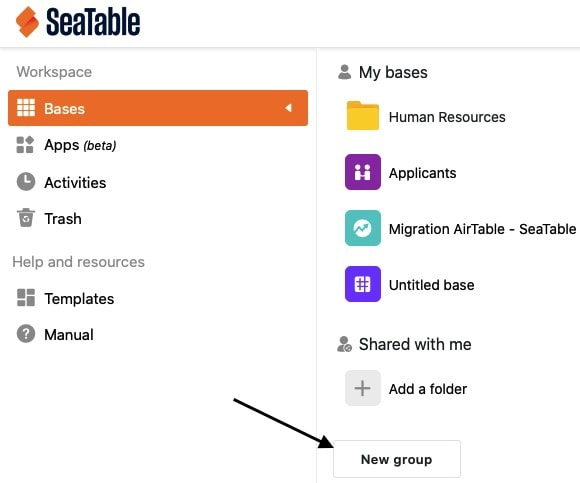
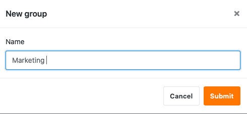
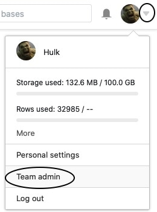
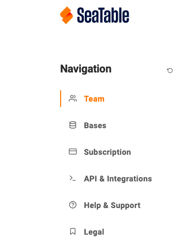
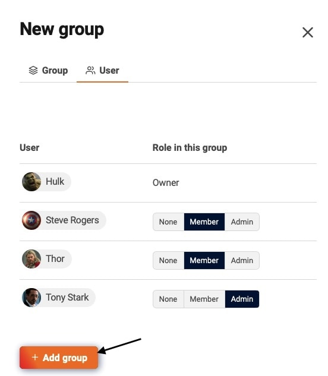

Organize your bases into groups, both to get a better overview of your topics and to more easily assign permissions within your team. Learn how to create a new group as a team member or as a team administrator:

## Create group in SeaTable

1. Switch to the SeaTable **home** page.
2. Scroll to the bottom of the page.
3. Click **New Group**.

5. Enter any name you like.



## Create group in Team administration

As a **team administrator**, you have a second option, which is to [create a group via the team administration]().

1. Switch to the SeaTable **home** page.
2. Click your **avatar image** in the upper right corner and then click **Team administration**.

4. Switch to the **Team** section.

6. Scroll to the end of the **Groups** tab.
7. Click the orange **Create Group** button.

9. Enter a **name for** the group, add **team members** and save clicking the **Add Group** button.

  

