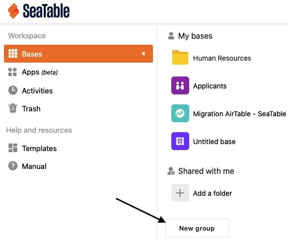

Organisez vos bases en groupes afin d'avoir une meilleure vue d'ensemble de vos thèmes et de pouvoir attribuer plus facilement des autorisations au sein de votre équipe. Vous apprendrez ici comment créer un nouveau groupe en tant que membre de l'équipe ou administrateur de l'équipe :

## Créer un groupe dans SeaTable

1. Passez à la **page d'accueil** de SeaTable.
2. Faites défiler jusqu'au bas de la page.
3. Cliquez sur **Nouveau groupe**.

5. Saisissez le nom de votre choix.



## Créer un groupe dans la gestion d'équipe

En tant qu'**administrateur d'équipe**, vous avez une deuxième possibilité, à savoir [créer un groupe via la gestion d'équipe]().

1. Passez à la **page d'accueil** de SeaTable.
2. Cliquez en haut à droite sur **l'image de** votre **avatar**, puis sur **Gestion d'équipe**.

4. Passez à la section **Équipe**.

6. Faites défiler jusqu'à la fin de l'onglet **Groupes**.
7. Cliquez sur le bouton orange **Créer un groupe**.

9. Donnez un **nom** au groupe, ajoutez **des membres de l'équipe** et enregistrez en cliquant sur le bouton **Ajouter un groupe**.

  

