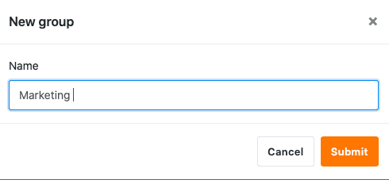
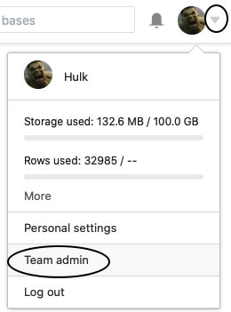
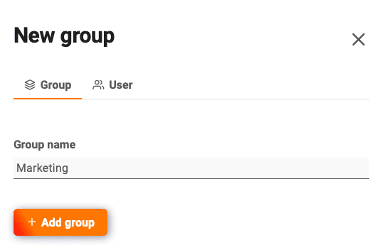

Organize as suas bases em grupos, tanto para ter uma melhor visão geral dos seus tópicos como para poder atribuir mais facilmente as permissões dentro da sua equipa. Aqui pode aprender como criar um novo grupo como membro da equipa ou como administrador da equipa:

## Criar grupo em SeaTable

1. Mudar para a página **inicial** da SeaTable.
2. Deslocar-se para o fundo da página.
3. Clique em **Novo Grupo**.

5. Digite qualquer nome.



## Criação de um grupo na administração da equipa

Como **administrador da equipa**, tem uma segunda opção, nomeadamente [criar um grupo através da administração da equipa]().

1. Mudar para a página **inicial** da SeaTable.
2. Clique na **imagem do** seu **avatar** no canto superior direito e depois em **Gestão de Equipas**.

4. Mudar para a secção **Equipa**.

6. Percorrer até ao fim do separador **Grupos**.
7. Clicar no botão laranja **Criar Grupo**.

9. Introduzir um **nome para** o grupo, adicionar **membros da equipa** e guardar clicando no botão **Adicionar Grupo**.

  

