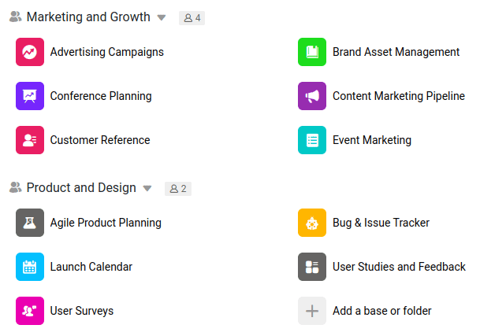

В команде не каждый член команды автоматически имеет доступ ко всем базам. Напротив: когда вы создаете новую базу, изначально только вы как создатель имеете доступ к этой базе - и только в ваших руках, кому разрешено работать вместе на этой новой базе. Для каждого члена команды, который должен иметь доступ к базе, должен быть создан соответствующий релиз базы.

Чтобы упростить этот повторяющийся процесс создания релизов, в SeaTable существуют группы. Группа - это объединение членов команды, которым разрешено работать вместе на базах. Если в группе создается новая база, все члены команды автоматически получают доступ к этой базе без необходимости получения разрешений.

Каждый член команды может создавать свои собственные группы и приглашать других членов команды присоединиться к ним. Поэтому вам следует создавать группы, когда:

- Вы знаете, что будете работать с несколькими людьми над разными проектами.
- Вы хотите, чтобы несколько человек могли видеть всю информацию и базы в вашей группе.

Подробнее о том, как [создать группу]().

## Пригласить других членов команды в группу

Группа имеет смысл, только если в ней более одного члена команды. Поэтому читайте здесь, как [добавить новых членов команды в группу]().

## Разрешения внутри группы

В принципе, каждый член группы может просматривать ее содержимое. Однако для того, чтобы иметь возможность создавать новые базы в группе, вы должны быть либо владельцем, либо администратором группы. Подробнее о различных [разрешениях в группе]() читайте здесь.

## Межкомандные группы

Межкомандные группы в настоящее время невозможны. Если вы хотите сотрудничать с кем-то вне вашей команды, вы должны создать [пригласительную ссылку]() для соответствующей базы и отправить ее этому человеку.
