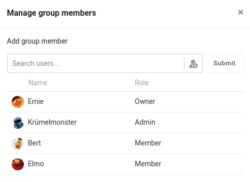

Within a SeaTable group there are three different roles: **Owner**, **Administrator** and **Member**. Depending on their role, which can be different from group to group, users are authorized to perform different actions. The following **table** provides you with an overview of what permissions each role has.

## All permissions at a glance

|                                                                                     | Owner                                                         | Admin                                                         | Member                                                        |
| ----------------------------------------------------------------------------------- | ------------------------------------------------------------- | ------------------------------------------------------------- | ------------------------------------------------------------- |
| Create new group                                                                    |  |  |  |
| Work in a base                                                                      |  |  |  |
| **Group management**                                                                |                                                               |                                                               |                                                               |
| Rename group                                                                        |  |                                    |                                    |
| Manage members                                                                      |  |  |                                    |
| Transfer group                                                                      |  |                                    |                                    |
| Leave group                                                                         |                                    |  |  |
| Delete group                                                                        |  |                                    |                                    |
| **Base management in a group**                                                      |                                                               |                                                               |                                                               |
| Add a base or Folder                                                                |  |  |                                    |
| Edit base                                                                           |  |  |                                    |
| Manage bases of a group in the trash                                                |  |  |                                    |
| Share bases                                                                         |  |  |                                    |
| Add bases to Favorites                                                              |  |  |  |
| Delete bases                                                                        |  |  |                                    |
| Move bases to a folder                                                              |  |  |                                    |
| Copy bases                                                                          |  |  |  |
| Export bases                                                                        |  |  |  |
| Set password for a base                                                             |  |  |                                    |
| Access and restore snapshots of a base                                              |  |  |  |
| Advanced features (API tokens, webhooks, attachment management and Seafile connect) |  |  |                                    |



If you want to assign a permission, our tutorial [Assigning Permissions in a Group]() will certainly help you.



## Which groups and bases do you see?

Each user can only see the groups he is a member of. Groups and bases you are not a member of will not be shown to you, of course.
