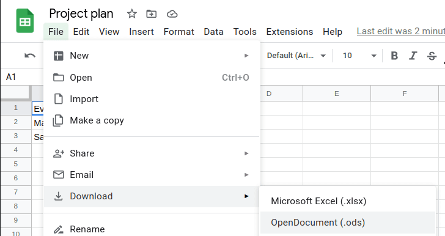

Im folgenden Artikel finden Sie eine Anleitung, wie Sie Daten aus Google Sheets in SeaTable importieren können.

## Daten-Import aus Google Sheets in SeaTable

1. Um Dateien aus Google Sheets in SeaTable importieren zu können, speichern Sie diese zunächst als **CSV-** oder **Excel-Datei**.

    

2. Im Anschluss können Sie die Dateien wie gewohnt in SeaTable **importieren**.
3. Eine detaillierte **Anleitung** zum Importieren der Dateien finden Sie im jeweiligen Übersichtsartikel zum [Excel-](https://seatable.io/docs/import-von-daten/import-von-excel-dateien-in-seatable/) bzw. [CSV-Import](https://seatable.io/?post_type=docs&p=16604).
