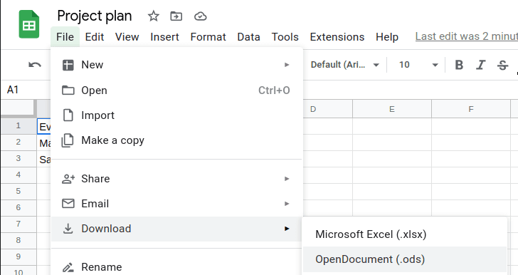

Dans l'article suivant, vous trouverez des instructions sur la manière d'importer des données de Google Sheets dans SeaTable.

## Importation de données de Google Sheets dans SeaTable

1. Pour pouvoir importer des fichiers de Google Sheets dans SeaTable, enregistrez-les d'abord en tant que **CSV-** ou **Fichier Excel**.

    

2. Vous pouvez ensuite **importer** les fichiers dans SeaTable comme d'habitude.

3. Vous trouverez des **instructions** détaillées sur l'importation des fichiers dans l'article d'aperçu correspondant sur [Excel]() ou [CSV-Import]().
