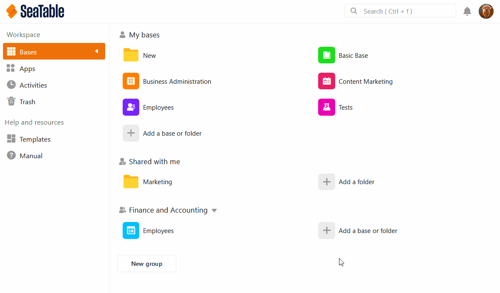
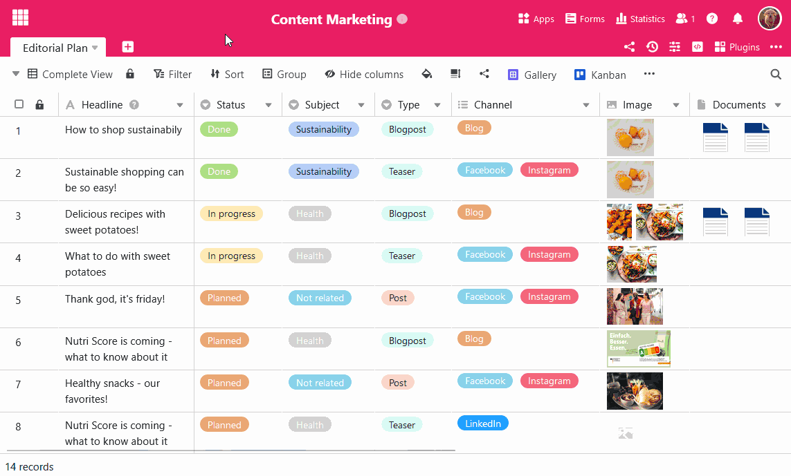

Der folgende Artikel dient als Übersicht über das Thema **Daten-Import** mithilfe von **CSV** in SeaTable. Im Artikel finden Sie eine detaillierte **Anleitung**, wie genau Sie CSV-Dateien in SeaTable importieren können. Darüber hinaus stellen wir Ihnen **Besonderheiten** vor, die Sie beim Daten-Import beachten sollten.

## Drei verschiedene Importmöglichkeiten

Mit der Import-Funktion von SeaTable können Sie CSV-Dateien in Ihre Bases übernehmen. Insgesamt stehen Ihnen dabei **drei** verschiedene Möglichkeiten zur Verfügung:

1. Eine CSV-Datei als **neue Tabelle** in eine **neue Base** importieren.
2. Eine CSV-Datei als **neue Tabelle** in eine **existierende Base** importieren.
3. Eine CSV-Datei in eine bereits **existierende Tabelle** importieren.



## Option 1: Als neue Base importieren

1. Wechseln Sie zur **Startseite** von SeaTable.
2. Klicken Sie im Arbeitsbereich **Meine Bases** oder innerhalb einer **Gruppe** auf **Eine Base oder Ordner hinzufügen**.
3. Klicken Sie auf **Base aus Datei (XLSX, CSV oder DTABLE) importieren**.
4. Wählen Sie in der sich öffnenden Datei-Übersicht von Ihrem Gerät die gewünschte **CSV-Datei** aus, die Sie importieren möchten.
5. Bestätigen Sie entweder mit einem **Doppelklick** auf die ausgewählte Datei oder mit einem Klick auf **Select** bzw. **Öffnen**.
6. Im Anschluss öffnet sich ein **Vorschaufenster**, damit Sie überprüfen können, wie die importierten Daten in SeaTable aussehen werden. Hier können Sie genauestens auswählen, **welche Spalten** der CSV-Datei Sie übernehmen möchten.
7. Klicken Sie auf **Abschicken**, um den Import abzuschließen.

## Option 2: Als neue Tabelle importieren

1. Öffnen Sie eine beliebige **existierende Base**.
2. Klicken Sie auf das **\[+\]-Symbol**, welches sich rechts neben dem Namen der letzten Tabelle befindet.
3. Klicken Sie auf **CSV- oder XLSX-Datei importieren**.
4. Wählen Sie in der sich öffnenden Datei-Übersicht von Ihrem Gerät die gewünschte **CSV-Datei** aus, die Sie als neue Tabelle importieren möchten.
5. Bestätigen Sie entweder mit einem **Doppelklick** auf die ausgewählte Datei oder mit einem Klick auf **Select** bzw. **Öffnen**.
6. Im Anschluss öffnet sich ein **Vorschaufenster**, damit Sie überprüfen können, wie die importierten Daten in SeaTable aussehen werden. Hier können Sie genauestens auswählen, **welche Spalten** der CSV-Datei Sie übernehmen möchten.
7. Klicken Sie auf **Abschicken**, um den Import abzuschließen.

## Option 3: In eine existierende Tabelle importieren

1. Klicken Sie rechts neben dem Namen Ihrer Tabelle auf das dreieckige **Drop-down-Symbol**.
2. Wählen Sie **Neue Daten aus CSV- oder XLSX-Datei importieren**.
3. Wählen Sie in der sich öffnenden Datei-Übersicht von Ihrem Gerät die gewünschte **CSV-Datei** aus, die Sie in die Tabelle importieren möchten.
4. Bestätigen Sie entweder mit einem **Doppelklick** auf die ausgewählte Datei oder mit einem Klick auf **Select** bzw. **Öffnen**.
5. Im Anschluss öffnet sich ein **Vorschaufenster**, damit Sie überprüfen können, wie die importierten Daten in SeaTable aussehen werden. Klicken Sie auf **Abschicken**, um den Import abzuschließen.



## Hinweise zum CSV-Import

Mit dem CSV-Import können Sie praktisch alle Ihre Daten in SeaTable importieren. Hier noch ein paar Hinweise, die Sie beim Import von CSV-Dateien beachten sollten:

- Beim Import von CSV-Dateien kann es dazu kommen, dass die Vorschau **nicht** alle Daten anzeigt, die in die Tabelle importiert werden, da in der **Vorschau** maximal **201 Zeilen** angezeigt werden können.
- Die Werte, die sich in der **ersten Zeile** einer mit CSV importierten Tabelle befinden, werden von SeaTable immer automatisch als **Spalten-Namen** verwendet und daher beim Import aus der ersten Zeile **entfernt**. Alle anderen Daten in der Tabelle werden dementsprechend **eine Zeile** nach oben verschoben.
- Beim Import von CSV-Dateien wird die **Art der Daten** von SeaTable **nicht** automatisch erkannt. Der Spaltentyp passt sich folglich (anders als beim Excel-Import) **nicht** an die individuellen Daten an.

## Welche Fehlermeldungen können bei einem gescheiterten Import der Daten erscheinen?

Bei einem **gescheiterten** Daten-Import können folgende Fehlermeldungen erscheinen:

Diese Fehlermeldung erscheint, wenn der Inhalt der Datei, die Sie importieren möchten, **ungültig** ist. Ein Grund für diese Fehlermeldung kann beispielsweise sein, dass die von Ihnen ausgewählte Datei **keine** CSV-Datei ist. Schauen Sie am besten nochmal unter dem **ersten Punkt** dieser **FAQs** nach, wie genau eine CSV-Datei für den Import aussehen muss.

Diese Fehlermeldung erscheint, wenn der Datei-Import aufgrund von Problemen mit der **Internetverbindung** fehlschlägt. Bitte stellen Sie sicher, dass Ihr Gerät mit dem **Internet verbunden** ist, und versuchen Sie es erneut.

## Häufig gestellte Fragen

Die CSV-Datei muss nach [UTF-8-Standard](https://de.wikipedia.org/wiki/UTF-8) formatiert sein und das Suffix **.csv** am **Ende des Dateinamens** enthalten.

**Nein**, es werden beim Import **keine** Daten ersetzt.

**Ja**, die importierten Daten werden in den entsprechenden Spalten der Tabelle unter den bereits existierenden Zeilen eingefügt.



## Weitere hilfreiche Artikel rund um den Import von CSV-Dateien in SeaTable

- [Tipps und Tricks beim Import von CSV-Dateien]()
- [Limitationen beim CSV-Import]()
