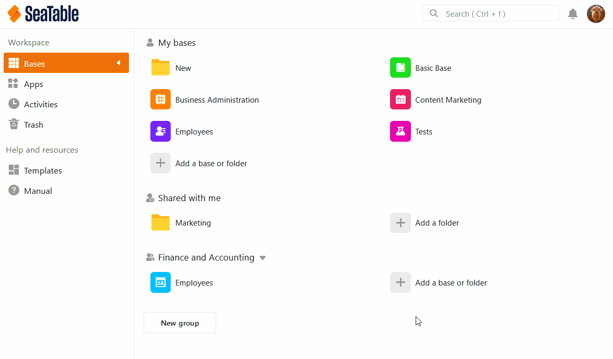
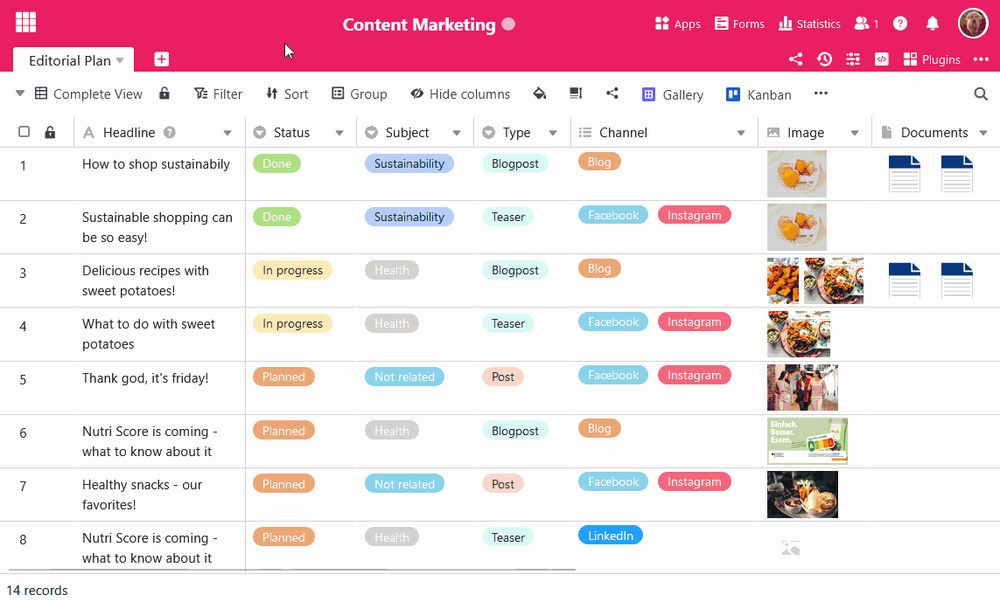
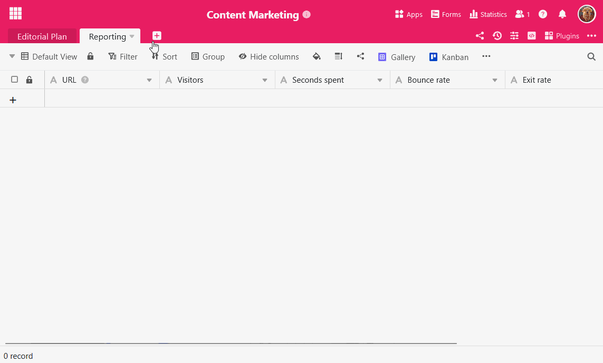

The following article serves as an overview of the topic of **importing data** using **CSV** in SeaTable. In the article you will find detailed **instructions on** how exactly to import CSV files into SeaTable. In addition, we will introduce you to **specifics** that you should be aware of when importing data.

## Three different import options

With the import function of SeaTable you can transfer CSV files into your bases. In total, there are **three** different options available to you:

1. Import a CSV file as a **new table** into a **new Base**.
2. Import a CSV file as a **new table** into an **existing base**.
3. Import a CSV file into an existing **table**.



## Option 1: Import as new base

1. Switch to the SeaTable **home** page.
2. In the **My Bases** workspace or within a **group**, click **Add a Base or Folder**.
3. Click **Import Base from File (XLSX, CSV or DTABLE)**.
4. In the opening file overview from your device, select the desired **CSV file** you want to import.
5. Confirm either by **double-clicking** the selected file or by clicking **Select** or **Open**.
6. A **preview window** will then open so that you can check how the imported data will look in SeaTable. Here you can select exactly **which columns** of the CSV file you want to import.
7. Click on **Submit** to complete the import.

## Option 2: Import as new table

1. Open any **existing base**.
2. Click the **\[+\] icon** located to the right of the name of the last table.
3. Click **Import CSV or XLSX file**.
4. In the opening file overview from your device, select the desired **CSV file** that you want to import as a new table.
5. Confirm either by **double-clicking** the selected file or by clicking **Select** or **Open**.
6. A **preview window** will then open so that you can check how the imported data will look in SeaTable. Here you can select exactly **which columns** of the CSV file you want to import.
7. Click on **Submit** to complete the import.

## Option 3: Import into an existing table

1. Click on the triangular **drop-down symbol** to the right of the name of your table.
2. Select **Import new data from CSV or XLSX file**.
3. In the opening file overview from your device, select the desired **CSV file** that you want to import into the table.
4. Confirm either by **double-clicking** the selected file or by clicking **Select** or **Open**.
5. A **preview window** will then open so you can check how the imported data will look in SeaTable. Click **Submit** to complete the import.



## Notes on CSV import

With the CSV import you can import virtually all your data into SeaTable. Here are a few more notes to keep in mind when importing CSV files:

- When importing CSV files, the preview may **not** show all the data that will be imported into the table, since the **preview** can display a maximum of **201 rows.**
- The values that are in the **first row** of a table imported with CSV are always automatically used by SeaTable as **column names** and therefore**removed from** the first row during import. All other data in the table will be moved up **one row** accordingly.
- When importing CSV files, the **type of data** is **not** automatically detected by SeaTable. Consequently, the column type does **not** adapt to the individual data (unlike the Excel import).

## Frequently asked questions



What must the CSV file look like that is to be imported into the table?|||

The CSV file must be formatted according to [the UTF-8 standard](https://de.wikipedia.org/wiki/UTF-8) and contain the suffix **.csv** at the **end of the file name**.

---

Will existing data be replaced during import?|||

**No**, **no** data is replaced during import.

---

Will the imported data simply be inserted under the existing rows ?|||

**Yes**, the imported data will be inserted in the corresponding columns of the table under the already existing rows .

---

What success message appears when the data is imported successfully?|||

If the data import is **successful**, the following success message appears:

---

What error messages may appear if the data import fails?|||

In case of a **failed** data import, the following error messages may appear:

This error message appears when the content of the file you want to import is **invalid**. One reason for this error message may be, for example, that the file you have selected is **not a** CSV file. It is best to look up again under the **first point of** this **FAQ**, how exactly a CSV file must look like for the import.

This error message appears when the file import fails due to **internet connection** problems. Please make sure your device is **connected to the Internet** and try again.



## More helpful articles around importing CSV files into SeaTable

- [Tips and tricks when importing CSV files]()
- [Limitations of CSV import]()
