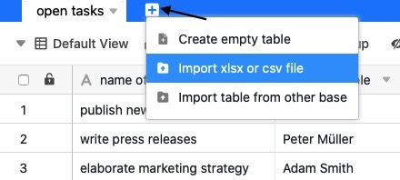

SeaTable's import features make it possible to switch from other solutions to SeaTable with little effort. The same is true when moving from one SeaTable system to another, for example, when migrating from SeaTable Cloud to a self-hosted system. You can seamlessly continue working on a base that you have imported from another SeaTable instance.

How to export bases and tables from SeaTable and import them into SeaTable is the topic of this article.

## Export base

You can export the current status of your bases including all tables, [views](https://seatable.io/en/docs/grundlagen-von-ansichten/was-ist-eine-ansicht/), [web forms](https://seatable.io/en/docs/webformulare/webformulare/), [statistics](https://seatable.io/en/docs/seatable-nutzen/statistiken/), [scripts](https://seatable.io/en/docs/javascript-python/import-und-export-eines-skriptes/) and even [plugins](https://seatable.io/en/docs/plugins/was-ist-ein-plugin/) via the **start page**. The export contains all table values as well as attachments in [image and file columns](https://seatable.io/en/docs/dateien-und-bilder/unterschiede-zwischen-bild-und-datei-spalte/). However, as a snapshot of a base, an export **does not** contain the [history](https://seatable.io/en/docs/historie-und-versionen/historie-und-logs/) of the base. [Comments](https://seatable.io/en/docs/arbeiten-mit-zeilen/die-kommentarfunktion-in-seatable/) and [automations](https://seatable.io/en/docs/automationen/uebersicht-ueber-automationen/) as well as [data in the big data backend](https://seatable.io/en/docs/big-data/potenzial-big-data/) are also **not exported**.

For exporting bases, SeaTable uses the [DTABLE file format](https://seatable.io/en/docs/import-von-daten/dtable-dateiformat/). For more information, see the article [Saving a Base as a DTABLE File](https://seatable.io/en/docs/import-von-daten/speichern-einer-base-als-dtable-datei/).

## Export table

You can **export** individual **tables to Excel files** from any base to which you have access. The contents of text and number-based columns are copied as values to the destination file. Contents of the [Formatted Text](https://seatable.io/en/docs/text-und-zahlen/die-spalten-text-und-formatierter-text/) type are written to the XLSX file in [Markdown format](https://en.wikipedia.org/wiki/Markdown). Images and files are also exported, but not in their binary format, but as a link including file metadata. [Comments](https://seatable.io/en/docs/arbeiten-mit-zeilen/die-kommentarfunktion-in-seatable/), [automations](https://seatable.io/en/docs/automationen/uebersicht-ueber-automationen/) and the [change history](https://seatable.io/en/docs/historie-und-versionen/historie-und-logs/) are **not exported**.

You start the export of a table from Base. Click on the drop-down arrow to the right of the name of the table you want to export. Now select **Export table to Excel** to start the download. Once the export is complete, you will find the XLSX file in the selected location on your device.

## Import base

SeaTable supports importing bases from its own [DTABLE format](https://seatable.io/en/docs/import-von-daten/dtable-dateiformat/), from **Excel files**, and from the generic **CSV format**. When importing a **DTABLE file**, the base is restored exactly as it looked at the time of export. When importing CSV or Excel, the values from the CSV/XLSX file are copied into table columns of a new base, and SeaTable tries to interpret the column types based on the data.

What you need to do when importing a base depends on the type of import file. However, the procedure is the same for all file types: go to the **Home** page and click **Add a Base or Folder** in the area or group where you want the new Base. You can get more detailed information in the following articles:

- [Creating a Base from a DTABLE File](https://seatable.io/en/docs/import-von-daten/erstellen-einer-base-aus-einer-dtable-datei/)
- [Import Excel files into SeaTable](https://seatable.io/en/docs/import-von-daten/import-von-excel-dateien-in-seatable/)
- [Data import using CSV in SeaTable](https://seatable.io/en/docs/import-von-daten/daten-import-mithilfe-von-csv-in-seatable/)

## Import table

In existing bases you can **fill** individual **tables via CSV or Excel import**. You have the following options: You can import the data into an **existing table**

or import the data into a **new table**.

The import is done as a [CSV file](https://seatable.io/en/docs/import-von-daten/daten-import-mithilfe-von-csv-in-seatable/) or [Excel file](https://seatable.io/en/docs/import-von-daten/import-von-excel-dateien-in-seatable/) into the table. For more information, see the linked articles.

If you have already created a table in **SeaTable** and need it in **another base**, you can simply copy it over. To learn how to import tables from another Base, [click here](https://seatable.io/en/docs/arbeiten-in-tabellen/eine-tabelle-in-einer-base-hinzufuegen/).



## More helpful articles about data import

- [Tips and tricks when importing CSV or XLSX files](https://seatable.io/en/docs/import-von-daten/tipps-und-tricks-beim-import-von-csv-oder-xlsx-dateien/)
- [Limitations with CSV/Excel import](https://seatable.io/en/docs/import-von-daten/limitationen-beim-csv-excel-import/)
- [Import of CSV data records into an existing base](https://seatable.io/en/docs/import-von-daten/import-von-csv-datensaetzen-in-eine-existierende-base/)
