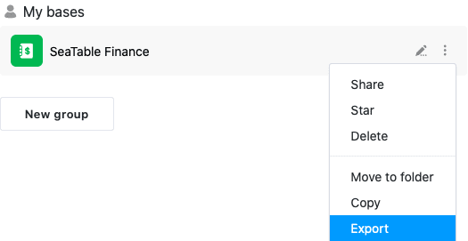
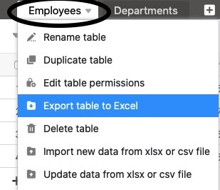
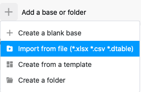
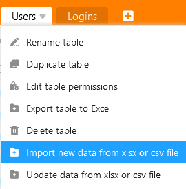
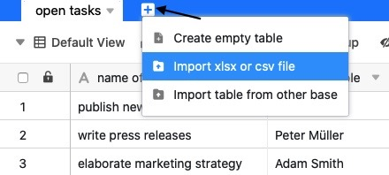

Les fonctions d'importation de SeaTable permettent de passer d'autres solutions à SeaTable sans trop d'efforts. Il en va de même pour le passage d'un système SeaTable à un autre, par exemple lors de la migration de SeaTable Cloud vers un système auto-hébergé. Vous pouvez continuer à travailler de manière transparente sur une base que vous avez importée d'une autre instance SeaTable.

Comment exporter des bases et des tableaux de SeaTable et les importer dans SeaTable, tel est le sujet de cet article.

## Exporter la base

La **page d'accueil** vous permet d'exporter l'état actuel de vos bases, y compris tous les tableaux, [vues](), [formulaires web]() et plugins. Les [commentaires](), les [automatisations]() et l'[historique des modifications]() ainsi que [les données du backend Big Data]() ne sont **pas exportés**.

Pour exporter des bases, SeaTable utilise le [format de fichier DTABLE](). Pour plus d'informations, consultez l'article [Enregistrer une base en tant que fichier DTABLE]().

## Exporter le tableau

Vous pouvez **exporter des tableaux** individuels de chaque base à laquelle vous avez accès **vers des fichiers Excel**. Les contenus des colonnes de texte et de chiffres sont copiés dans le fichier cible sous forme de valeurs. Les [commentaires](), les [automatisations]() et l'[historique des modifications]() ne sont **pas exportés**.

Vous lancez l'exportation d'un tableau à partir de la base. Cliquez sur la flèche déroulante à droite du nom du tableau à exporter. Sélectionnez maintenant **Exporter le tableau vers Excel** pour démarrer le téléchargement. Dès que l'exportation est terminée, vous trouverez le fichier XLSX à l'emplacement choisi sur votre appareil.

## Importer la base

SeaTable prend en charge l'importation de bases depuis son propre [format DTABLE](), depuis **des fichiers Excel** ainsi que depuis le **format** générique **CSV**. Lors de l'importation d'un **fichier DTABLE**, la base est restaurée exactement telle qu'elle était au moment de l'exportation. Lors de l'importation de fichiers CSV ou Excel, les valeurs du fichier CSV/XLSX sont copiées dans les colonnes du tableau d'une nouvelle base, SeaTable essayant d'interpréter les types de colonnes en fonction des données.

Ce à quoi vous devez faire attention lors de l'importation d'une base dépend du type de fichier d'importation. La procédure est cependant la même pour tous les types de fichiers : allez sur la **page d'accueil** et cliquez sur **Ajouter une base ou un dossier** dans le domaine ou le groupe où vous souhaitez avoir la nouvelle base. Vous trouverez des informations plus précises dans les articles suivants :

- [Création d'une base à partir d'un fichier DTABLE]()
- [Importation de fichiers Excel dans SeaTable]()
- [Importation de données dans SeaTable à l'aide de CSV]()

## Importer un tableau

Dans les bases existantes, vous pouvez **remplir** des **tableaux** individuels **par importation CSV ou Excel**. Pour cela, vous avez les options suivantes : Vous pouvez importer les données dans un **tableau existant**.

ou importer les données dans un **nouveau tableau**.

L'importation se fait sous forme de [fichier CSV]() ou [de fichier Excel]() dans le tableau. Pour plus d'informations, consultez les articles en lien.

Si vous avez déjà créé un tableau dans **SeaTable** et que vous en avez besoin **dans une autre base**, vous pouvez simplement le copier. Pour savoir comment importer des tableaux d'une autre base, [cliquez ici]().



Le backend normal de SeaTable peut contenir au maximum 100.000 lignes par tableau. Si vous souhaitez importer un fichier Excel ou CSV contenant plus de 100.000 lignes, vous devez d'abord [activer le backend Big Data]() pour pouvoir l'importer.



## Autres articles utiles sur le thème de l'importation de données

- [Trucs et astuces pour l'importation de fichiers CSV ou XLSX]()
- [Limites de l'importation CSV/Excel]()
- [Importation d'enregistrements CSV dans une base existante]()
