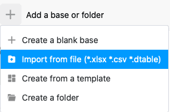
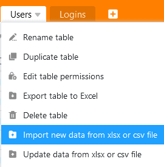

As funções de importação do SeaTable permitem passar de outras soluções para o SeaTable com pouco esforço. O mesmo se aplica à mudança de um sistema SeaTable para outro, por exemplo, ao migrar de um sistema SeaTable Cloud para um sistema auto-hospedado. Pode continuar a trabalhar sem problemas sobre uma base que tenha importado de outra instância SeaTable.

Como exportar bases e tabelas do SeaTable e importá-las para o SeaTable é o tema deste artigo.

## Base de exportação

Pode exportar o estado atual das suas bases, incluindo todas as tabelas, [vistas](https://seatable.io/pt/docs/grundlagen-von-ansichten/was-ist-eine-ansicht/), [formulários Web](https://seatable.io/pt/docs/webformulare/webformulare/), [estatísticas](https://seatable.io/pt/docs/seatable-nutzen/statistiken/), [scripts](https://seatable.io/pt/docs/javascript-python/import-und-export-eines-skriptes/) e até [plugins](https://seatable.io/pt/docs/plugins/was-ist-ein-plugin/) através da **página inicial**. A exportação contém todos os valores da tabela, bem como os anexos nas [colunas de imagens e ficheiros](https://seatable.io/pt/docs/dateien-und-bilder/unterschiede-zwischen-bild-und-datei-spalte/). No entanto, como um instantâneo de uma base, uma exportação **não** contém o [histórico](https://seatable.io/pt/docs/historie-und-versionen/historie-und-logs/) da base. [Os comentários](https://seatable.io/pt/docs/arbeiten-mit-zeilen/die-kommentarfunktion-in-seatable/) e as [automatizações](https://seatable.io/pt/docs/automationen/uebersicht-ueber-automationen/), bem como [os dados no backend de big data](https://seatable.io/pt/docs/big-data/potenzial-big-data/), também **não** são **exportados**.

SeaTable utiliza o [formato de ficheiro DTABLE](https://seatable.io/pt/docs/import-von-daten/dtable-dateiformat/) para exportar bases. Para mais informações, ver o artigo [Salvando uma Base como um ficheiro DTABLE](https://seatable.io/pt/docs/import-von-daten/speichern-einer-base-als-dtable-datei/).

## Tabela de exportação

Pode **exportar tabelas** individuais a partir de cada base a que tem acesso **para ficheiros Excel**. O conteúdo das colunas baseadas em texto e números são copiadas como valores para o ficheiro de destino. Os conteúdos do tipo de [texto formatado](https://seatable.io/pt/docs/text-und-zahlen/die-spalten-text-und-formatierter-text/) são escritos no ficheiro XLSX em [formato Markdown](https://en.wikipedia.org/wiki/Markdown). Imagens e ficheiros são também exportados, mas não no seu formato binário, mas como uma ligação que inclui metadados de ficheiros. [Comentários](https://seatable.io/pt/docs/arbeiten-mit-zeilen/die-kommentarfunktion-in-seatable/), [automatizações](https://seatable.io/pt/docs/automationen/uebersicht-ueber-automationen/) e o [histórico de alterações](https://seatable.io/pt/docs/historie-und-versionen/historie-und-logs/) **não** são **exportados**.

Inicia-se a exportação de uma mesa a partir da Base. Clique na seta para a direita do nome da tabela a ser exportada. Agora seleccione **Exportar tabela para Excel** para iniciar o download. Quando a exportação estiver concluída, encontrará o ficheiro XLSX no local seleccionado no seu dispositivo.

## Base de importação

SeaTable suporta a importação de bases a partir do seu próprio [formato DTABLE](https://seatable.io/pt/docs/import-von-daten/dtable-dateiformat/), de **ficheiros Excel** e do **formato** genérico **CSV**. Quando se importa um **ficheiro DTABLE**, a base é restaurada exactamente como se apresentava no momento da exportação. Ao importar um ficheiro CSV ou Excel, os valores do ficheiro CSV/XLSX são copiados para colunas de tabela de uma nova base, e o SeaTable tenta interpretar os tipos de colunas com base nos dados.

O que tem de considerar ao importar uma base depende do tipo de ficheiro de importação. Contudo, o procedimento é o mesmo para todos os tipos de ficheiro: Vá à página **inicial** e clique em **Adicionar uma base ou pasta** na área ou grupo onde pretende ter a nova base. Pode encontrar informações mais detalhadas nos artigos seguintes:

- [Criação de uma Base a partir de um ficheiro DTABLE](https://seatable.io/pt/docs/import-von-daten/erstellen-einer-base-aus-einer-dtable-datei/)
- [Importar ficheiros Excel para o SeaTable](https://seatable.io/pt/docs/import-von-daten/import-von-excel-dateien-in-seatable/)
- [Importação de dados usando CSV em SeaTable](https://seatable.io/pt/docs/import-von-daten/daten-import-mithilfe-von-csv-in-seatable/)

## Tabela de importação

Nas bases existentes, pode **preencher tabelas** individuais **via CSV ou importação Excel**. Tem as seguintes opções: Pode importar os dados para uma **tabela existente**

ou importar os dados para uma **nova tabela**.

A importação tem lugar como [ficheiro CSV](https://seatable.io/pt/docs/import-von-daten/daten-import-mithilfe-von-csv-in-seatable/) ou [ficheiro Excel](https://seatable.io/pt/docs/import-von-daten/import-von-excel-dateien-in-seatable/) na tabela. Para mais informações, ver os artigos ligados.

Se já tiver criado uma mesa no **SeaTable** e precisar dela **noutra base**, pode simplesmente copiá-la. Pode descobrir [aqui](https://seatable.io/pt/docs/arbeiten-in-tabellen/eine-tabelle-in-einer-base-hinzufuegen/) como importar tabelas de outra base.



## Outros artigos úteis sobre o tema da importação de dados

- [Dicas e truques para a importação de ficheiros CSV ou XLSX](https://seatable.io/pt/docs/import-von-daten/tipps-und-tricks-beim-import-von-csv-oder-xlsx-dateien/)
- [Limitações da importação de CSV/Excel](https://seatable.io/pt/docs/import-von-daten/limitationen-beim-csv-excel-import/)
- [Importação de conjuntos de dados CSV para uma base existente](https://seatable.io/pt/docs/import-von-daten/import-von-csv-datensaetzen-in-eine-existierende-base/)
