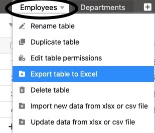

Функции импорта SeaTable позволяют переходить от других решений к SeaTable без особых усилий. То же самое касается перехода от одной системы SeaTable к другой, например, при переходе от SeaTable Cloud к системе, размещаемой самостоятельно. Вы можете продолжать беспрепятственно работать с базой, которую вы импортировали из другого экземпляра SeaTable.

Как экспортировать базы и таблицы из SeaTable и импортировать их в SeaTable - тема этой статьи.

## Экспортная база

Вы можете экспортировать текущее состояние базы, включая все таблицы, [представления](), [веб-формы]() и [автоматизация](https://seatable.io/ru/docs/automationen/uebersicht-ueber-automationen/), а также [данные в бэкенде больших данных](https://seatable.io/ru/docs/big-data/potenzial-big-data/) также **не экспортируются**.

SeaTable использует [формат файла DTABLE](https://seatable.io/ru/docs/import-von-daten/dtable-dateiformat/) для экспорта баз. Для получения дополнительной информации см. статью [Сохранение базы в виде файла DTABLE](https://seatable.io/ru/docs/import-von-daten/speichern-einer-base-als-dtable-datei/).

## Таблица экспорта

Вы можете **экспортировать** отдельные **таблицы** из каждой базы, к которой у вас есть доступ, **в файлы Excel**. Содержимое текстовых и числовых столбцов копируется в целевой файл в виде значений. Содержимое типа [Форматированный текст](), [автоматизация](https://seatable.io/ru/docs/automationen/uebersicht-ueber-automationen/) и [история изменений](https://seatable.io/ru/docs/historie-und-versionen/historie-und-logs/) **не экспортируются**.

Вы начинаете экспорт таблицы из Base. Нажмите на выпадающую стрелку справа от названия таблицы, которую нужно экспортировать. Теперь выберите **Экспорт таблицы в Excel**, чтобы начать загрузку. После завершения экспорта вы найдете файл XLSX в выбранном месте на вашем устройстве.

## Импортная база

SeaTable поддерживает импорт баз из собственного [формата DTABLE](https://seatable.io/ru/docs/import-von-daten/dtable-dateiformat/), из **файлов Excel** и из общего **формата CSV**. При импорте **файла DTABLE** база восстанавливается в том виде, в котором она выглядела на момент экспорта. При импорте файла CSV или Excel значения из файла CSV/XLSX копируются в колонки таблицы новой базы, и SeaTable пытается интерпретировать типы колонок на основе данных.

То, что вы должны учитывать при импорте базы, зависит от типа файла импорта. Однако процедура одинакова для всех типов файлов: перейдите на **стартовую** страницу и нажмите на **Добавить базу или папку** в области или группе, где вы хотите иметь новую базу. Более подробную информацию вы можете найти в следующих статьях:

- [Создание базы из файла DTABLE](https://seatable.io/ru/docs/import-von-daten/erstellen-einer-base-aus-einer-dtable-datei/)
- [Импорт файлов Excel в SeaTable](https://seatable.io/ru/docs/import-von-daten/import-von-excel-dateien-in-seatable/)
- [Импорт данных с помощью CSV в SeaTable](https://seatable.io/ru/docs/import-von-daten/daten-import-mithilfe-von-csv-in-seatable/)

## Таблица импорта

В существующих базах вы можете **заполнить** отдельные **таблицы через импорт CSV или Excel**. У вас есть следующие варианты: Вы можете импортировать данные в **существующую таблицу**

или импортировать данные в **новую таблицу**.

Импорт происходит в виде [файла CSV](https://seatable.io/ru/docs/import-von-daten/daten-import-mithilfe-von-csv-in-seatable/) или [файла Excel](https://seatable.io/ru/docs/import-von-daten/import-von-excel-dateien-in-seatable/) в таблицу. Для получения дополнительной информации см. статьи по ссылке.

Если вы уже создали таблицу в **SeaTable** и она нужна вам в **другой базе**, вы можете просто скопировать ее. О том, как импортировать таблицы из другой базы, вы можете узнать [здесь]().



## Другие полезные статьи по теме импорта данных

- [Советы и рекомендации по импорту файлов CSV или XLSX](https://seatable.io/ru/docs/import-von-daten/tipps-und-tricks-beim-import-von-csv-oder-xlsx-dateien/)
- [Ограничения импорта CSV/Excel](https://seatable.io/ru/docs/import-von-daten/limitationen-beim-csv-excel-import/)
- [Импорт наборов данных CSV в существующую базу](https://seatable.io/ru/docs/import-von-daten/import-von-csv-datensaetzen-in-eine-existierende-base/)
