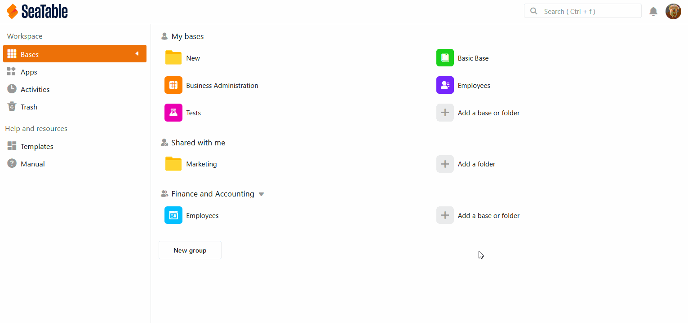
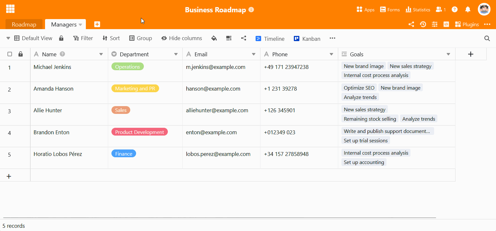
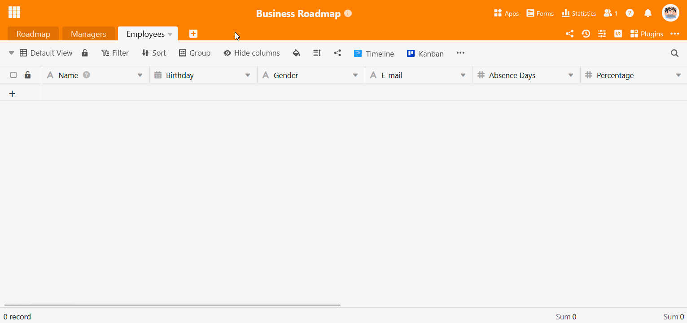

Der folgende Artikel dient als Übersicht über das Thema **Daten-Import aus XLSX-Dateien** in SeaTable. Im Artikel finden Sie eine detaillierte **Anleitung**, wie genau Sie Excel-Tabellen in SeaTable importieren können. Weiterhin stellen wir Ihnen **Besonderheiten** vor, die Sie beim Daten-Import beachten sollten.

## XLSX-Dateien in SeaTable importieren

Mit der leistungsstarken Import-Funktion von SeaTable können Sie Arbeitsblätter aus Ihren Excel-Arbeitsmappen in Ihre Bases übernehmen. Importieren Sie dazu einfach Dateien mit den Endungen **.xls** oder **.xlsx**. Sogar Excel-Tabellen mit vielen Tausend Zeilen werden in wenigen Augenblicken in SeaTable bereitgestellt.

Insgesamt stehen Ihnen dabei **drei** verschiedene Möglichkeiten zur Verfügung:

1. Eine XLSX-Datei als **neue Tabelle** in eine **neue Base** importieren.
2. Eine XLSX-Datei als **neue Tabelle** in eine **existierende Base** importieren.
3. Eine XLSX-Datei in eine bereits **existierende Tabelle** importieren.

## Option 1: Import als neue Base

1. Wechseln Sie zur **Startseite** von SeaTable.
2. Klicken Sie im Arbeitsbereich **Meine Bases** oder innerhalb einer **Gruppe** auf **Eine Base oder Ordner hinzufügen**.
3. Klicken Sie auf **Base aus Datei (XLSX, CSV oder DTABLE) importieren**.
4. Wählen Sie in der sich öffnenden Datei-Übersicht von Ihrem Gerät die gewünschte **Datei** aus, die Sie importieren möchten.
5. Bestätigen Sie entweder mit einem **Doppelklick** auf die ausgewählte Datei oder mit einem Klick auf **Select** bzw. **Öffnen**.
6. Im Anschluss öffnet sich ein **Vorschaufenster**, damit Sie überprüfen können, wie die importierten Daten in SeaTable aussehen werden. Hier können Sie genauestens auswählen, **welche Spalten** und **welche Tabellen** Sie aus der XLSX-Arbeitsmappe übernehmen möchten.
7. Klicken Sie auf **Abschicken**, um den Import abzuschließen.

## Option 2: Import als neue Tabelle

1. Öffnen Sie eine beliebige, bereits existierende **Base**.
2. Klicken Sie auf das **\[+\]-Symbol**, welches sich rechts neben dem Namen der letzten Tabelle befindet.
3. Klicken Sie auf **CSV- oder XLSX-Datei importieren**.
4. Wählen Sie in der sich öffnenden Datei-Übersicht von Ihrem Gerät die gewünschte **Datei** aus, die Sie als neue Tabelle importieren möchten.
5. Bestätigen Sie entweder mit einem **Doppelklick** auf die ausgewählte Datei oder mit einem Klick auf **Select** bzw. **Öffnen**.
6. Im Anschluss öffnet sich ein **Vorschaufenster**, damit Sie überprüfen können, wie die importierten Daten in SeaTable aussehen werden. Hier können Sie genauestens auswählen, **welche Spalten** und **welche Tabellen** Sie aus der XLSX-Arbeitsmappe übernehmen möchten.
7. Klicken Sie auf **Abschicken**, um den Import abzuschließen.

## Option 3: Import in eine bereits existierende Tabelle

1. Klicken Sie rechts neben dem Namen Ihrer Tabelle auf das **dreieckige Drop-down-Symbol**.
2. Wählen Sie **Neue Daten aus CSV- oder XLSX-Datei importieren**.
3. Wählen Sie in der sich öffnenden Datei-Übersicht von Ihrem Gerät die gewünschte **Datei** aus, die Sie in die Tabelle importieren möchten.
4. Bestätigen Sie entweder mit einem **Doppelklick** auf die ausgewählte Datei oder mit einem Klick auf **Select** bzw. **Öffnen**.
5. Im Anschluss öffnet sich ein **Vorschaufenster**, in dem Sie überprüfen können, wie die importierten Daten in SeaTable aussehen werden. Klicken Sie auf **Abschicken**, um den Import abzuschließen.



## Häufige Fragen

Die Importvorschau zeigt, welche Datenstrukturen in SeaTable importiert werden. In der **Vorschau** werden jedoch maximal **201 Zeilen** angezeigt.

SeaTable kann mit mehreren Arbeitsblättern umgehen und versucht jedes Arbeitsblatt in eine Tabelle umzuwandeln.

Die Werte, die sich in der **ersten Zeile** einer importierten Excel-Tabelle befinden, werden von SeaTable immer automatisch als **Spalten-Namen** verwendet und daher beim Import aus der ersten Zeile **entfernt**. Alle anderen Daten in der Tabelle werden dementsprechend **eine Zeile** nach oben verschoben.

SeaTable versucht anhand der Werte in den ersten Zeilen den Spaltentyp automatisch zu bestimmen. Bestimmte **Datentypen** werden von SeaTable **automatisch** erkannt. Werden beispielsweise **Nummern** oder **Daten (Jahr-Monat-Tag)** importiert, passt das Programm automatisch den **Spaltentyp** an die importierten Daten an.



## Eine XLSX-Datei in den Big-Data-Speicher importieren

Standardmäßig erlaubt SeaTable die Speicherung von **bis zu 100.000 Zeilen**, wobei die Importfunktion maximal 50.000 Zeilen in einer Excel-Tabelle unterstützt. Wenn Sie noch größere Datensätze in SeaTable importieren möchten, können Sie den **Big-Data-Speicher** nutzen. [Hier]() erfahren Sie, wie Sie eine **XLSX-Datei in den Big-Data-Speicher importieren**.

## Weitere hilfreiche Artikel zum Import von Daten

Beim Import von Daten können Sie – je nachdem, in welcher Form die Ausgangsdatei vorliegt – auf Schwierigkeiten stoßen. Sollte etwas nicht funktionieren, helfen Ihnen vielleicht die folgenden Artikel weiter:

- [Tipps und Tricks beim Excel-Import]()
- [Limitationen beim Excel-Import]()
