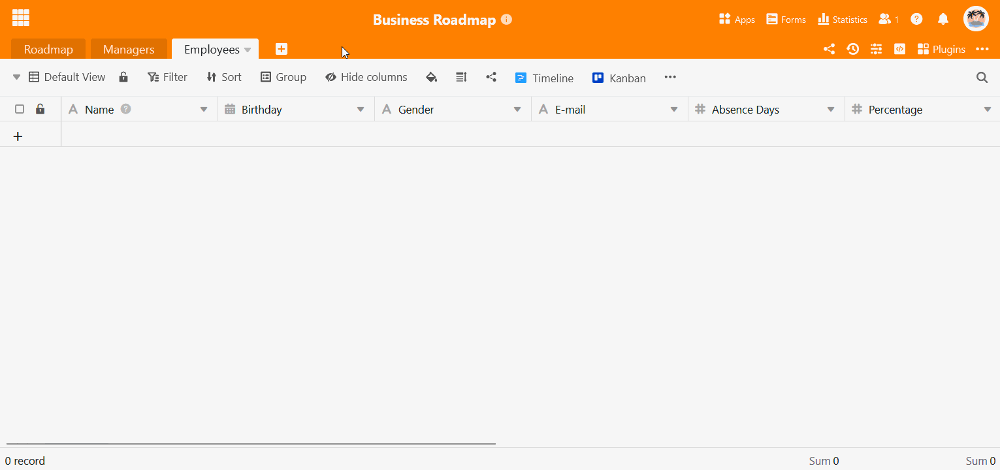

The following article serves as an overview of the topic of **importing data from XLSX files** into SeaTable. In the article you will find detailed **instructions** on how exactly you can import Excel tables into SeaTable. We also present **special features** that you should be aware of when importing data.

## Import XLSX files into SeaTable

With SeaTable's powerful import function, you can transfer worksheets from your Excel workbooks into your bases. Simply import files with the extensions **.xls** or **.xlsx**. Even Excel spreadsheets with many thousands of rows are made available in SeaTable in just a few moments.

A total of **three** different options are available to you:

1. Import an XLSX file as a **new table** into a **new base**.
2. Import an XLSX file as a **new table** into an **existing base**.
3. Import an XLSX file into an **existing table**.

## Option 1: Import as new base

1. Switch to the SeaTable **home** page.
2. In the **My Bases** workspace or within a **group**, click **Add a Base or Folder**.
3. Click on **Import base from file (XLSX, CSV or DTABLE)**.
4. In the file overview that opens, select the **file** you want to import from your device.
5. Confirm either by **double-clicking** the selected file or by clicking **Select** or **Open**.
6. A **preview window** will then open so that you can check how the imported data will look in SeaTable. Here you can select exactly **which columns** and **which tables** you want to import from the XLSX workbook.
7. Click on **Submit** to complete the import.

## Option 2: Import as a new table

1. Open any **base** that already exists.
2. Click the **\[+\] icon** located to the right of the name of the last table.
3. Click **Import CSV or XLSX file**.
4. In the file overview that opens, select the desired **file** from your device that you want to import as a new table.
5. Confirm either by **double-clicking** the selected file or by clicking **Select** or **Open**.
6. A **preview window** will then open so that you can check how the imported data will look in SeaTable. Here you can select exactly **which columns** and **which tables** you want to import from the XLSX workbook.
7. Click on **Submit** to complete the import.

## Option 3: Import into an existing table

1. Click on the **triangular drop-down symbol** to the right of the name of your table.
2. Select **Import new data from CSV or XLSX file**.
3. In the file overview that opens, select the desired **file** from your device that you want to import into the table.
4. Confirm either by **double-clicking** the selected file or by clicking **Select** or **Open**.
5. A **preview window** will then open in which you can check how the imported data will look in SeaTable. Click on **Submit** to complete the import.



## Frequently asked questions



Why does the import preview not show all values?|||

The import preview shows which data structures will be imported into SeaTable. However, the **preview** shows a maximum of **201 rows**.

---

Can multiple worksheets be imported from Excel?|||

SeaTable can handle multiple worksheets and tries to convert each worksheet into a table.

---

Why is my first row not imported?|||

The values that are in the **first row** of an imported Excel table are always automatically used by SeaTable as **column names** and therefore**removed from** the first row during import. All other data in the table will be moved up **one row** accordingly.

---

Does SeaTable detect the column type automatically?|||

SeaTable tries to determine the column type automatically based on the values in the first rows . Certain **data types** are **automatically** recognized by SeaTable. For example, if **numbers** or **dates (year-month-day)** are imported, the program automatically adjusts the **column type** to the imported data.



## Importing an XLSX file into the Big Data store

By default, SeaTable allows the storage of up to **100,000 rows**, whereby the import function supports a maximum of 50,000 rows in an Excel spreadsheet. If you want to import even larger data sets into SeaTable, you can use the **big data storage**. [Here](https://seatable.io/en/docs/big-data/eine-excel-tabelle-ins-big-data-backend-importieren/) you can find out how to import an **XLSX file into the** Big Data store.

## More helpful articles about importing data

Depending on the form of the source file, you may encounter difficulties when importing data. If something does not work, the following articles may help you:

- [Excel import tips and tricks](https://seatable.io/en/docs/import-von-daten/tipps-und-tricks-beim-import-von-csv-oder-xlsx-dateien/)
- [Limitations of Excel import](https://seatable.io/en/docs/import-von-daten/limitationen-beim-csv-excel-import/)
