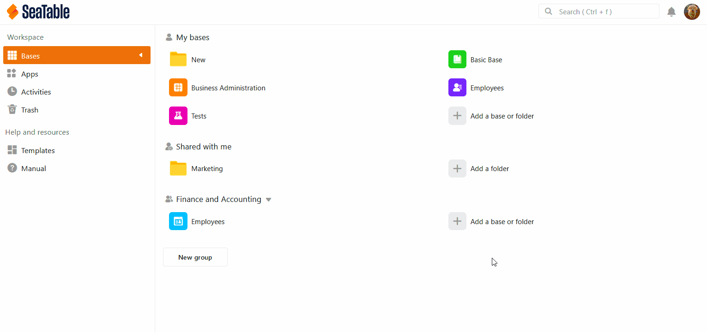

L'article suivant sert d'aperçu sur le thème de **l'importation de données depuis des fichiers XLSX** dans SeaTable. Vous y trouverez **des instructions** détaillées sur la manière d'importer des feuilles de calcul Excel dans SeaTable. Nous vous présentons également les **particularités** à prendre en compte lors de l'importation de données.

## Importer des fichiers XLSX dans SeaTable

La puissante fonction d'importation de SeaTable vous permet de transférer des feuilles de calcul de vos classeurs Excel vers vos bases. Il suffit d'importer des fichiers portant l'extension **.xls** ou **.xlsx**. Même les feuilles de calcul Excel contenant plusieurs milliers de lignes sont mises à disposition dans SeaTable en quelques instants.

Au total, **trois** possibilités différentes s'offrent à vous :

1. Importer un fichier XLSX en tant que **nouveau tableau** dans une **nouvelle base**.
2. Importer un fichier XLSX en tant que **nouveau tableau** dans une **base existante**.
3. Importer un fichier XLSX dans un **tableau** déjà **existant**.

## Option 1 : importation en tant que nouvelle base

1. Passez à la **page d'accueil** de SeaTable.
2. Dans l'espace de travail **Mes bases** ou au sein d'un **groupe**, cliquez sur **Ajouter une base ou un dossier**.
3. Cliquez sur **Importer la base à partir d'un fichier (XLSX, CSV ou DTABLE)**.
4. Dans l'aperçu des fichiers de votre appareil qui s'ouvre, sélectionnez le **fichier** que vous souhaitez importer.
5. Confirmez soit par un **double-clic** sur le fichier sélectionné, soit par un clic sur **Select** ou **Ouvrir**.
6. Une **fenêtre d'aperçu** s'ouvre ensuite pour vous permettre de vérifier à quoi ressembleront les données importées dans SeaTable. Ici, vous pouvez choisir avec précision **quelles colonnes** et **quels tableaux** vous souhaitez transférer depuis le classeur XLSX.
7. Cliquez sur **Envoyer** pour terminer l'importation.

## Option 2 : importation en tant que nouveau tableau

1. Ouvrez n'importe quelle **base** existante.
2. Cliquez sur le **symbole \[+\]** qui se trouve à droite du nom du dernier tableau.
3. Cliquez sur **Importer un fichier CSV ou XLSX**.
4. Dans l'aperçu des fichiers de votre appareil qui s'ouvre, sélectionnez le **fichier** souhaité que vous souhaitez importer comme nouveau tableau.
5. Confirmez soit par un **double-clic** sur le fichier sélectionné, soit par un clic sur **Select** ou **Ouvrir**.
6. Une **fenêtre d'aperçu** s'ouvre ensuite pour vous permettre de vérifier à quoi ressembleront les données importées dans SeaTable. Ici, vous pouvez choisir avec précision **quelles colonnes** et **quels tableaux** vous souhaitez transférer depuis le classeur XLSX.
7. Cliquez sur **Envoyer** pour terminer l'importation.

## Option 3 : importation dans un tableau existant

1. Cliquez sur l'**icône triangulaire déroulante** à droite du nom de votre tableau.
2. Sélectionnez **Importer de nouvelles données à partir d'un fichier CSV ou XLSX**.
3. Dans l'aperçu des fichiers de votre appareil qui s'ouvre, sélectionnez le **fichier** que vous souhaitez importer dans le tableau.
4. Confirmez soit par un **double-clic** sur le fichier sélectionné, soit par un clic sur **Select** ou **Ouvrir**.
5. Une **fenêtre d'aperçu** s'ouvre ensuite, dans laquelle vous pouvez vérifier l'aspect des données importées dans SeaTable. Cliquez sur **Envoyer** pour terminer l'importation.



## Questions fréquentes

L'aperçu de l'importation montre quelles structures de données seront importées dans SeaTable. Toutefois, l'**aperçu** affiche un maximum de **201 lignes**.

SeaTable peut gérer plusieurs feuilles de calcul et tente de convertir chaque feuille de calcul en tableau.

Les valeurs qui se trouvent sur la **première ligne** d'une feuille de calcul Excel importée sont toujours utilisées automatiquement par SeaTable comme **noms de colonne** et sont donc **supprimées** de la première ligne lors de l'importation. Toutes les autres données du tableau sont en conséquence déplacées **d'une ligne** vers le haut.

SeaTable essaie de déterminer automatiquement le type de colonne en fonction des valeurs des premières lignes. Certains **types de données** sont **automatiquement** reconnus par SeaTable. Par exemple, si **des numéros** ou **des dates (année-mois-jour)** sont importés, le programme adapte automatiquement le **type de colonne** aux données importées.



## Importer un fichier XLSX dans le référentiel Big Data

Par défaut, SeaTable permet de stocker **jusqu'à 100 000 lignes**, la fonction d'importation prenant en charge un maximum de 50 000 lignes dans une feuille de calcul Excel. Si vous souhaitez importer des ensembles de données encore plus importants dans SeaTable, vous pouvez utiliser le **stockage Big Data**. [Cliquez ici]() pour savoir comment **importer** un **fichier XLSX dans la mémoire Big Data**.

## Autres articles utiles sur l'importation de données

Lors de l'importation de données, vous pouvez rencontrer des difficultés en fonction de la forme du fichier source. Si quelque chose ne fonctionne pas, les articles suivants vous aideront peut-être :

- [Trucs et astuces pour l'importation Excel]()
- [Limites de l'importation Excel]()
