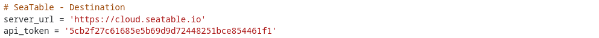
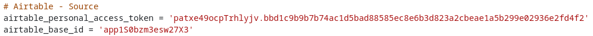
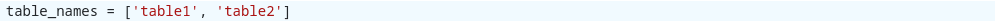
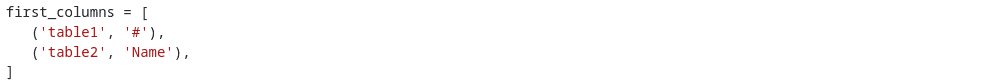
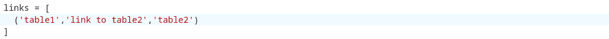
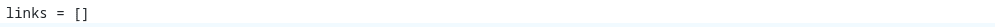
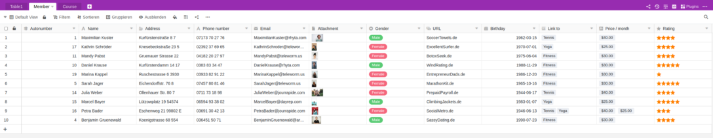
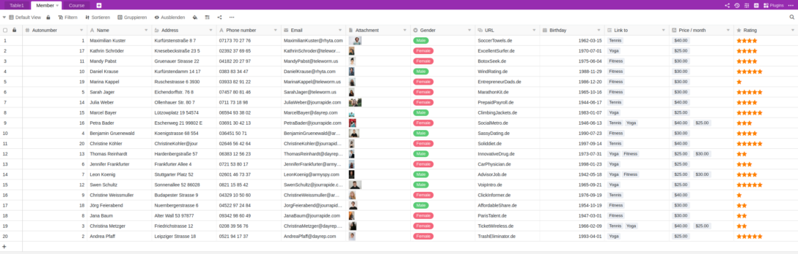

Sie wollen Ihre Airtable Bases zu SeaTable umziehen und scheuen den Aufwand? Keine Sorge! Auch Bases mit komplizierten Datenstrukturen und vielen tausend Datensätzen lassen sich rasch in SeaTable übertragen.

Für den Transfer der Airtable Daten in SeaTable haben wir ein Migrationsskript entwickelt. Dieses überträgt alle Daten in einer Airtable Base - Tabellen, Spalten, Datensätze - in einem Rutsch in eine SeaTable Base. Nach der Migration können Sie in SeaTable mit den Daten weitermachen, die Sie in Airtable zuletzt verwendet haben. Nach Ausführung des Skripts sind nur einige Nacharbeiten notwendig.

Das Skript kann jeder - Techniker wie nicht-Techniker - verwenden. Es sind nur ein paar **manuelle Angaben** erforderlich, um das Skript betriebsbereit zu machen. In diesem Artikel erklären wir, wie Sie das machen.



## Wie Sie eine Base von Airtable zu SeaTable migrieren

### 1\. Base anlegen

Erstellen Sie in SeaTable eine [neue Base](). Der Name der SeaTable Base muss nicht dem Namen der zu importierenden Airtable Base entsprechen. Sie können den Namen frei wählen.

### 2\. Skript einfügen

Öffnen Sie in der neuen Base die [Skript-Seitenleiste]() durch einen Klick auf das Skript-Icon  im Base-Header oben rechts. Wählen Sie dann **Skript hinzufügen**. Das Migrationsskript ist in der Programmiersprache Python geschrieben. Wählen Sie daher **Python** aus.

Markieren Sie nun den folgenden Codeblock, kopieren ihn in den Zwischenspeicher und fügen Sie ihn dann in das linke Fenster des Skripteditors ein:

```
## Parameterize the script

# SeaTable - Destination
server_url = 'https://cloud.seatable.io'
api_token = '...'
# Add an API token of the SeaTable base
# See https://seatable.io/docs/en/seatable-api/erzeugen-eines-api-tokens/
# for more information on how to create a SeaTable API token

# Airtable - Source
airtable_personal_access_token = '...'
# Add a Personal Access Token (PAT)
# PATs are 82-character strings and begin with "pat" (e.g. 'pat544WlSOq6T4Fvv.5710af6611aedbf28493c38084163494e02b24f078cf2d62f07105982a82a64d')
# See https://support.airtable.com/docs/creating-personal-access-tokens/
# for more information on how to create a PAT in Airtable

airtable_base_id = '...'
# Add the Base ID of the Airtable base
# Base IDs are alphanumeric strings and begin with "app" (e.g. 'appRfA3qspH3EJUnV')
# See https://support.airtable.com/docs/finding-airtable-ids/
# for more information on where to find the id of an Airtable base

table_names = ['...', '...']
# Add the names of all tables of the Airtable base, i.e. ['table 1', 'table 2']
# The names must be enclosed in '' and comma-separated

first_columns = [
   ('...', '...'),
   ('...', '...'),
]
# Specify the names of the first columns in every table of the Airtable base
# Use the format ('table_name', 'first_column_name'), i.e. ('table 1', 'ID')
# The table and column name must be enclosed in '' and comma-separated

links = [
]
# Specify the links between the tables in the Airtable base
# Use the format ('table_name', 'column_name', 'other_table_name'), i.e., ('table 1', 'link to table 2', 'table 2')
# The table and column names must be enclosed in '' and comma-separated
# If the Airtable base contains no link columns, just leave the brackets empty

from seatable_api.constants import ColumnTypes
excluded_column_types = [
    ColumnTypes.FILE
]
# Specify the column types which are to be excluded from the data import when running the script in import-rows mode (excluded column types are still created in import-header mode)
# Use the constants from https://developer.seatable.io/scripts/python/objects/constants/, i.e. ColumnTypes.FILE to exclude file columns
# The specified column types must be comma-separated
# If no column types are to be excluded, just leave the brackets empty
# ColumnTypes.LINK_FORMULA are always excluded

excluded_columns = []
# Specify the names of the columns which are to be excluded from the data import when running script in import-rows mode (excluded columns are still created in import-header mode)
# Use the format ('table_name', 'column_name'), i.e. ('table 1', 'column A')
# The table and column names must be enclosed in '' and comma-separated
# If no columns are to be excluded, just leave the brackets empty

mode = 'import-header'
# Specify the run-mode of the script, two options: 'import-header' and 'import-rows'
# Run 'import-header' first to create the data structure in the SeaTable base
# Run 'import-rows' to import all the rows


## No more edits required beyond this row

import sys
from seatable_api import Base, AirtableConvertor

def get_convertor():
    base = Base(api_token, server_url)
    base.auth()
    convertor = AirtableConvertor(
        airtable_api_key=airtable_personal_access_token,
        airtable_base_id=airtable_base_id,
        base=base,
        table_names=table_names,
        first_columns=first_columns,
        links=links,
    )
    return convertor

def import_header():
    convertor = get_convertor()
    convertor.convert_metadata()

def import_rows():
    convertor = get_convertor()
    convertor.convert_data()

if mode == 'import-header':
   import_header()

elif mode == 'import-rows':
   import_rows()

else:
   print('The mode is not properly specified.')

## End script
##
```

Machen Sie sich keine Gedanken, wenn Sie den gerade kopierten Code nicht verstehen. Wir erläutern ihn. Ein wenig bei der Interpretation helfen sollten die Kommentare im Code. Kommentare sind alle Zeilen mit führendem Rautezeichen ('#'). Diese Zeilen werden bei der Skriptausführung nicht beachtet, d.h. Sie können Kommentare verändern, löschen oder auch weitere hinzufügen, ohne die Funktionalität des Skripts zu beeinflussen.

Anders als die Kommentare sind die Einrückungen im Code bei der Ausführung des Skripts sehr wichtig. Verändern Sie diese bitte nicht.

### 3\. SeaTable Server URL und API-Token der Base angeben

Fügen Sie unter dem Kommentar **SeaTable – Destination** die SeaTable Server URL ein und geben Sie den [API-Token](https://seatable.io/docs/seatable-api/erzeugen-eines-api-tokens/) an. Der API-Token muss Lese- und Schreibrechte gewähren. Wenn Sie SeaTable Cloud verwenden, dann ist die vorausgefüllte URL "https://cloud.seatable.io" richtig. Wenn Sie einen anderen SeaTable Server verwenden, dann tragen Sie dessen URL ein. (Die URL muss immer mit https:// bzw. http:// eingegeben werden.) URL und Token müssen von einfachen Anführungszeichen umschlossen sein.

Dies ist eine Beispielkonfiguration für den Import der Daten in eine Base in SeaTable Cloud: 

### 4\. Airtable Personal Access Token und Base ID eintragen

Ergänzen Sie unter dem Kommentar **Airtable – Source** den [Airtable Personal Access Token (PAT)](https://support.airtable.com/docs/creating-personal-access-tokens) sowie die [Airtable Base ID](https://support.airtable.com/docs/finding-airtable-ids), beide Werte wieder jeweils in einfachen Anführungszeichen. Der PAT muss über die Berechtigung `data.records:read` und `schema.bases:read` verfügen.

So sollte es dann aussehen, wobei Ihre Werte natürlich anders sind: 

Nutzen Sie die im Skript hinterlegten Links zur Airtable Dokumentation, um zu erfahren, wo Sie PAT und Base ID erhalten.

### 5\. Tabellen- und Spaltennamen eintragen

Teilen Sie dem Skript nun mit, welche Tabellen Sie aus der Airtable Base importieren möchten. Tun Sie dies in der Zeile "table_names". Ergänzen Sie in der eckigen Klammer die Namen der Tabellen - jeweils umschlossen von einem einfachen Anführungszeichen und getrennt durch Komma.

Für eine Base mit den zwei Tabellen "table1" und "table2" muss die Zeile dann beispielsweise so aussehen: 

Wenn Ihre Airtable Base mehr als zwei Tabellen hat, verlängern Sie die Aufzählung in der Klammer einfach. Wenn Sie nicht alle Tabellen einer Base übertragen wollen, dann lassen Sie einfach die Namen derjenigen Tabellen weg, die nicht kopiert werden sollen.

Aufgrund einer Einschränkung der Airtable API müssen Sie auch die Namen der ersten Spalten in den Tabellen angeben. Dies erfolgt in der Zeile "first_columns" bzw. den Folgezeilen.

Für die Airtable Base mit den zwei Tabellen "table1" und "table2" könnte es dann so aussehen: 

### 6\. Verknüpfungsspalten festlegen

Damit SeaTable die Daten richtig importieren kann, ist noch ein weiterer Schritt erforderlich: die Spezifikation der [Verknüpfungsspalten]() in der Airtable Base.

Dafür ist die Variable "links" vorgesehen. Wenn beispielsweise die Spalte "link to table2" in der Tabelle "table1" eine Verknüpfung mit der Tabelle "table 2" abbildet, dann sollte das Skript wie folgt parametrisiert werden:



Jedes Linkspaltenpaar müssen Sie nur einmal angeben. Sie müssen die Verknüpfung nicht in beiden Richtungen spezifizieren.

Erhält die Airtable Base keine Verknüpfungsspalten, dann können Sie die eckige Klammer leer lassen: 

### 7\. Spalten bzw. Spaltentypen auschließen (optional)

Wenn Sie nicht alle Spalten oder Spaltentypen von Airtable zu SeaTable kopieren möchten, dann können Sie diese ausschließen. Der Ausschluss einer Spalte oder eines Spaltentyps sorgt dafür, dass die Spalte in der SeaTable Base angelegt, die darin enthaltenen Daten aber nicht übertragen werden. Durch den Ausschluss von Spalten mit sehr großen Datenmengen - und wir denken insbesondere an Dateispalten - können Sie die Laufzeit des Skripts deutlich reduzieren. Gerade für einen Migrationstest bietet es sich an, Spalten mit hohem Datenvolumen auszuschließen.

Spaltentypen lassen sich über die Variable "excluded_column_types" ausschließen. Für die Spezfikation der auszuschließenden Spaltentypen verwenden Sie die dafür vorgesehenen Python Constants. Einzelne Spalten lassen sich über die Variable "excluded_columns" ausschließen. Die Spezifikation erfolgt analog der Variable "first_columns" im Format ('Tabellenname', 'Spaltenname'). Wenn Sie mehrere Spalten ausschließen wollen, dann müssen die Werte durch Komma getrennt werden.

### 8\. Tabellen und Spalten importieren

Das Skript kann in zwei Modi ausgeführt werden: "import-header" und "import-rows". Zunächst muss das Skript immer im Modus "import-header" ausgeführt werden. In diesem Modus werden die Tabellen und Spalten in der SeaTable Base angelegt und 10 Testzeilen importiert.

Der Ausführungsmodus wird in über die gleichnamigen Variable festgelegt: 

Führen Sie das Skript jetzt mit einem Klick auf **Skript ausführen** aus. Während der Ausführung sehen Sie auf der rechten Seite im Editor die ausgeführten Schritte. Im Hintergrund sehen Sie auch, wie die Tabellen und Spalten angelegt werden.



### 9\. Testzeilen überprüfen

Prüfen Sie nun, ob

- alle Tabellen und alle Spalten importiert wurden,
- in allen Tabellen die richtige erste Spalte angelegt wurde und
- die Verknüpfungsspalten korrekt sind.

Da die Spaltentypen von Airtable und SeaTable nicht vollständig kongruent sind, werden manchen Spaltentypen in der SeaTable Base von denen in der Airtable Base abweichen. Die folgende Tabelle stellt dar, wie die Spaltentypen in Airtable in SeaTable übertragen werden.

| Airtable Spaltentyp    | Import in SeaTable Spaltentyp    |
| ---------------------- | -------------------------------- |
| Attachment             | Datei                            |
| Autonumber             | Text                             |
| Barcode                | Text                             |
| Button                 | -                                |
| Checkbox               | Checkbox                         |
| Count                  | -                                |
| Created by             | Text                             |
| Created time           | Datum                            |
| Currency               | Zahl                             |
| Date                   | Datum                            |
| Duration               | Dauer                            |
| Email                  | E-Mail                           |
| Formula                | Formel (mit Platzhalterformel)   |
| Last modified by       | Text                             |
| Last modified time     | Datum                            |
| Link to another record | Verknüpfung zu anderen Einträgen |
| Long text              | Formatierter Text                |
| Lookup                 | -                                |
| Multiple select        | Mehrfachauswahl                  |
| Number                 | Zahl                             |
| Percent                | Zahl                             |
| Phone number           | Text                             |
| Rating                 | Rating                           |
| Rollup                 | -                                |
| Single line text       | Text                             |
| Single select          | Einfachauswahl                   |
| User                   | Text                             |
| URL                    | URL                              |

Eine besondere Rolle spielen Formelspalten sowie die Airtable Spaltentypen Count, Lookup und Rollup. Für erstere wird in der SeaTable Base eine Formelspalte mit dem Ergebnis "Formula to be defined" angelegt. Leider ist es aktuell nicht möglich, eine Airtable Formel automatisch in eine SeaTable Formel zu übersetzen. Ähnlich verhält es sich mit den anderen erwähnten Spaltentypen. Diese werden vom Skript nicht automatisch angelegt. Diejenigen Spalten, die vom Skript nicht angelegt werden, werden in der separaten Tabelle "Columns to be migrated manually" aufgelistet.

Wenn etwas nicht richtig ist, dann löschen Sie die durch das Skript angelegten Tabellen und überprüfen Sie die Eingaben in den Schritten 5. und 6. Führen Sie daraufhin das Skript erneut im Modus "import-header" aus. Sie können das Skript beliebig häufig ausführen.



### 10\. Alle Datensätze importieren

Wenn die Überprüfung in Schritt 9. zu Ihrer Zufriedenheit ist, dann können alle Datensätze übertragen werden.

Ändern Sie im Skript den Modus von "import-header" zu "import-rows":


Führen Sie das Skript mit einem Klick auf **Skript ausführen** erneut aus. Wieder können Sie auf der rechten Seite die Ausführung des Skripts beobachten und im Hintergrund die Aktivitäten sehen.





Nun sollten Sie alle Datensätze aus der Airtable Base in der neuen SeaTable Base sehen. Gratulation, die Migration der Datensätze ist abgeschlossen!

Wenn Sie mit dem Endergebnis nicht zufrieden sind, dann [löschen Sie alle Tabellen](https://seatable.io/docs/arbeiten-in-tabellen/loeschen-einer-tabelle-aus-einer-base/) und starten erneut bei Schritt 5.

### 11\. Migration abschließen

Das Migrationsskript hat alle Daten übertragen. Einige manuelle Nacharbeiten sind nun ggf. noch notwendig.

Zum einen müssen Sie die Formeln in Formelspalten ergänzen sowie die nicht automatisch angelegten und in der Tabelle "Columns to be migrated manually" aufgeführten Spalten hinzufügen.

Zum anderen müssen Sie auch Ansichten selbst anlegen, da diese nicht aus der Airtable Base übertragen werden. Das gleiche gilt für Automationen, Interfaces und Skripte.

## FAQ-Bereich

 Ändert das Skript Daten in meiner Airtable Base?

|||

Nein. Das Skript liest ausschließlich Ihre Airtable Base aus. Die Daten in der Airtable Base werden nicht verändert.

---

Wie verhalte ich mich bei Fehlermeldungen?

|||

Eine Fehlermeldung bei der ersten Ausführung ist gar nicht unwahrscheinlich. Gründe dafür gibt es genug, z.B. ein falscher Token, eine inkorrekte Reihenfolge bei der Spezifikation der Verlinkungen, Tippfehler, fehlende Kommas oder eine nicht korrekte Einrückung. Ein einzelner Fehler kann zu einem Abbruch der Skriptausführung führen. Wenn Sie eine Fehlermeldung erhalten, dann ist dies grundsätzlich kein Problem. Daten können keine verloren gehen. Gehen Sie wie folgt vor, um die Ursache des Fehlers zu finden: - Die Fehlermeldung gibt Ihnen in den meisten Fällen ein Hinweis, wo der Fehler zu finden ist. Folgen Sie diesem, korrigieren Sie die eingegebenen Parameter und führen Sie das Skript erneut aus. Ein Einrückungsfehler (englich "indentation") beispielsweise verweist auf eine nicht der Python-Syntax entsprechende Einrückung hin. - Ist die Fehlermeldung unverständlich, prüfen Sie alle Eingaben auf Korrektheit und versuchen Sie es nochmals. - Wenn keiner der Tipps hilft, holen Sie sich Hilfe im [SeaTable Forum](https://forum.seatable.io/). 

---

Können Airtable Bases beliebiger Größe migriert werden?

|||

Grundsätzlich ja. Die in diesem Artikel vorgestellten Vorgehensweise mit dem integrierten Python Editor unterliegt jedoch einer maximalen Laufzeitbeschränkung von 15 Minuten, d.h. Skripte, die länger als 15 Minuten laufen, werden abgebrochen. In der Praxis ist dies für die allermeisten Bases ausreichend. Bei Bases mit großen/vielen Dateianhängen kann dieses Limit jedoch eine Rolle spielen. In dem Fall können Sie durch das Ausschließen von Spalten die Laufzeit verrringern. Wenn Sie Spalten nicht ausschließen wollen, dann müssen Sie das Python Skript lokal auf einem Rechner ausführen, bei dem es keine Laufzeitbeschränkung gibt.

---

Kann man Tabellen in eine bestehende Base importieren?

|||

Das Skript erfordert nicht, dass eine Base leer ist. Sie können das Skript also auch in einer Base mit bestehenden, gefüllten Tabellen ausführen. Das Einzige, was Sie vermeiden sollten, ist die Duplizierung von Tabellennamen.


