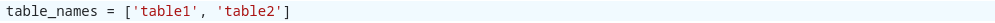
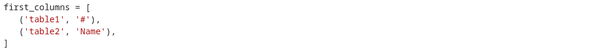
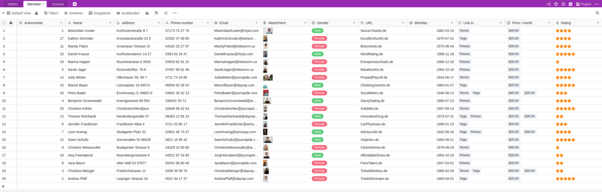

You want to move your Airtable Bases to SeaTable and are afraid of the effort? Don't worry! Even bases with complicated data structures and many thousands of data records can be quickly transferred to SeaTable.

We have developed a migration script for the transfer of Airtable data to SeaTable. This transfers all data in an Airtable base - tables, columns, data records - to a SeaTable base in one go. After the migration, you can continue in SeaTable with the data that you last used in Airtable. After executing the script, only a few adjustments are necessary.

The script can be used by anyone - technicians and non-technicians alike. Only a few **manual entries** are required to make the script ready for use. In this article, we explain how to do this.



## How to migrate a Base from Airtable to SeaTable

### 1\. create base

Create a [new base]() in SeaTable. The name of the SeaTable Base does not have to be the same as the name of the Airtable Base you want to import. You can choose the name freely.

### 2\. insert script

In the new Base, open the [script sidebar]() by clicking on the script icon  in the Base header at the top right. Then select **Add script**. The migration script is written in the Python programming language. Therefore, select **Python**.

Now select the following code block, copy it to the clipboard and then paste it into the left window of the script editor:

```
## Parameterize the script

# SeaTable - Destination
server_url = 'https://cloud.seatable.io'
api_token = '...'
# Add an API token of the SeaTable base
# See https://seatable.io/docs/en/seatable-api/erzeugen-eines-api-tokens/
# for more information on how to create a SeaTable API token

# Airtable - Source
airtable_personal_access_token = '...'
# Add a Personal Access Token (PAT)
# PATs are 82-character strings and begin with "pat" (e.g. 'pat544WlSOq6T4Fvv.5710af6611aedbf28493c38084163494e02b24f078cf2d62f07105982a82a64d')
# See https://support.airtable.com/docs/creating-personal-access-tokens/
# for more information on how to create a PAT in Airtable

airtable_base_id = '...'
# Add the Base ID of the Airtable base
# Base IDs are alphanumeric strings and begin with "app" (e.g. 'appRfA3qspH3EJUnV')
# See https://support.airtable.com/docs/finding-airtable-ids/
# for more information on where to find the id of an Airtable base

table_names = ['...', '...']
# Add the names of all tables of the Airtable base, i.e. ['table 1', 'table 2']
# The names must be enclosed in '' and comma-separated

first_columns = [
   ('...', '...'),
   ('...', '...'),
]
# Specify the names of the first columns in every table of the Airtable base
# Use the format ('table_name', 'first_column_name'), i.e. ('table 1', 'ID')
# The table and column name must be enclosed in '' and comma-separated

links = [
]
# Specify the links between the tables in the Airtable base
# Use the format ('table_name', 'column_name', 'other_table_name'), i.e., ('table 1', 'link to table 2', 'table 2')
# The table and column names must be enclosed in '' and comma-separated
# If the Airtable base contains no link columns, just leave the brackets empty

from seatable_api.constants import ColumnTypes
excluded_column_types = [
    ColumnTypes.FILE
]
# Specify the column types which are to be excluded from the data import when running the script in import-rows mode (excluded column types are still created in import-header mode)
# Use the constants from https://developer.seatable.io/scripts/python/objects/constants/, i.e. ColumnTypes.FILE to exclude file columns
# The specified column types must be comma-separated
# If no column types are to be excluded, just leave the brackets empty
# ColumnTypes.LINK_FORMULA are always excluded

excluded_columns = []
# Specify the names of the columns which are to be excluded from the data import when running script in import-rows mode (excluded columns are still created in import-header mode)
# Use the format ('table_name', 'column_name'), i.e. ('table 1', 'column A')
# The table and column names must be enclosed in '' and comma-separated
# If no columns are to be excluded, just leave the brackets empty

mode = 'import-header'
# Specify the run-mode of the script, two options: 'import-header' and 'import-rows'
# Run 'import-header' first to create the data structure in the SeaTable base
# Run 'import-rows' to import all the rows


## No more edits required beyond this row

import sys
from seatable_api import Base, AirtableConvertor

def get_convertor():
    base = Base(api_token, server_url)
    base.auth()
    convertor = AirtableConvertor(
        airtable_api_key=airtable_personal_access_token,
        airtable_base_id=airtable_base_id,
        base=base,
        table_names=table_names,
        first_columns=first_columns,
        links=links,
    )
    return convertor

def import_header():
    convertor = get_convertor()
    convertor.convert_metadata()

def import_rows():
    convertor = get_convertor()
    convertor.convert_data()

if mode == 'import-header':
   import_header()

elif mode == 'import-rows':
   import_rows()

else:
   print('The mode is not properly specified.')

## End script
##
```

Don't worry if you don't understand the code you have just copied. We will explain it. The comments in the code should help a little with interpretation. Comments are all rows with a leading hash sign ('#'). These rows are not taken into account when the script is executed, i.e. you can change, delete or add comments without affecting the functionality of the script.

Unlike the comments, the indentations in the code are very important when running the script. Please do not change them.

### 3\. specify SeaTable Server URL and API token of the base

Add the SeaTable server URL under the **SeaTable - Destination** comment and enter the [API token](https://seatable.io/en/docs/seatable-api/erzeugen-eines-api-tokens/). The API token must grant read and write permissions. If you are using SeaTable Cloud, then the prefilled URL "https://cloud.seatable.io" is correct. If you are using a different SeaTable server, enter its URL. (The URL must always be entered with https:// or http://.) The URL and token must be enclosed in single quotation marks.

This is an example configuration for importing data into a base in SeaTable Cloud:  


### 4\. enter Airtable Personal Access Token and Base ID

Add below the comment **Airtable - Source** the [Airtable Personal Access Token (PAT)](https://support.airtable.com/docs/creating-personal-access-tokens) and the [Airtable Base ID](https://support.airtable.com/docs/finding-airtable-ids)both values again in single quotation marks. The PAT must have the authorization `data.records:read` and `schema.bases:read` have.

This is what it should look like, although your values will of course be different:  


Use the links in the script to the Airtable documentation to find out where you can obtain PAT and Base ID.

### 5\. enter table and column names

Now tell the script which tables you want to import from the Airtable Base. Do this in the row "table_names". Add the names of the tables in the square brackets - each enclosed by a single quotation mark and separated by a comma.

For a base with the two tables "table1" and "table2", the row must then look like this, for example:  


If your Airtable Base has more than two tables, simply extend the list in brackets. If you do not want to transfer all tables of a base, simply omit the names of the tables that are not to be copied.

Due to a limitation of the Airtable API, you must also specify the names of the first columns in the tables. This is done in the row "first_columns" or the following rows.

For the Airtable Base with the two tables "table1" and "table2" it could look like this:  


### 6\. define link columns

In order for SeaTable to import the data properly, one more step is required: specifying the [link columns]() in Airtable Base.

The variable "links" is intended for this purpose. For example, if the "link to table2" column in the "table1" table represents a link to the "table 2" table, then the script should be parameterized as follows:


You need to specify each link column pair only once. You do not need to specify the link in both directions.

If the airtable base does not receive any link columns, then you can leave the square bracket empty:  


### 7\. exclude columns or column types (optional)

If you do not want to copy all columns or column types from Airtable to SeaTable, you can exclude them. Excluding a column or column type ensures that the column is created in the SeaTable Base, but the data it contains is not transferred. By excluding columns with very large amounts of data - and we are thinking in particular of file columns - you can significantly reduce the runtime of the script. Excluding columns with a high volume of data is particularly useful for a migration test.

Column types can be excluded via the variable "excluded_column_types". To specify the column types to be excluded, use the Python constants provided for this purpose. Individual columns can be excluded via the variable "excluded_columns". The specification is analogous to the variable "first_columns" in the format ('table name', 'column name'). If you want to exclude several columns, the values must be separated by commas.

### 8\. import tables and columns

The script can be executed in two modes: "import-header" and "import-rows". First, the script must always be executed in "import-header" mode. In this mode, the tables and columns are created in the SeaTable Base and 10 test rows are imported.

The execution mode is defined via the variable of the same name:  


Now run the script by clicking **Run Script**. During the execution you can see the executed steps on the right side in the editor. In the background you can also see how the tables and columns are created.



### 9\. check test lines

Now check whether

- all tables and all columns have been imported,
- the correct first column has been created in all tables and
- the link columns are correct.

Since the column types of Airtable and SeaTable are not completely congruent, some column types in the SeaTable Base will differ from those in the Airtable Base. The following table shows how the column types in Airtable are transferred to SeaTable.

| **Airtable column type** | **Import to SeaTable column type** |
| ------------------------ | ---------------------------------- |
| Attachment               | File                               |
| Autonumber               | Text                               |
| Barcode                  | Text                               |
| Button                   | \-                                 |
| Checkbox                 | Checkbox                           |
| Count                    | \-                                 |
| Created by               | Text                               |
| Created time             | Date                               |
| Currency                 | Number                             |
| Date                     | Date                               |
| Duration                 | Duration                           |
| Email                    | E-mail                             |
| Formula                  | Formula (with placeholder formula) |
| Last modified by         | Text                               |
| Last modified time       | Date                               |
| Link to another record   | Link to other entries              |
| Long text                | Formatted text                     |
| Lookup                   | \-                                 |
| Multiple select          | Multiple selection                 |
| Number                   | Number                             |
| Percent                  | Number                             |
| Phone number             | Text                               |
| Rating                   | Rating                             |
| Rollup                   | \-                                 |
| Single line text         | Text                               |
| Single select            | Single selection                   |
| User                     | Text                               |
| URL                      | URL                                |

Formula columns and the Airtable column types Count, Lookup and Rollup play a special role. For the former, a formula column with the result "Formula to be defined" is created in the SeaTable Base. Unfortunately, it is currently not possible to automatically translate an Airtable formula into a SeaTable formula. The situation is similar with the other column types mentioned. These are not created automatically by the script. Those columns that are not created by the script are listed in the separate table "Columns to be migrated manually".

If something is not correct, delete the tables created by the script and check the entries in steps 5 and 6. Then run the script again in "import-header" mode. You can run the script as often as you like.


### 10\. import all data records

If you are satisfied with the check in step 9, all data records can be transferred.

In the script, change the mode from "import-header" to "import-rows":


Run the script again by clicking **Run Script**. Again you can watch the execution of the script on the right side and see the activities in the background.





Now you should see all records from the Airtable Base in the new SeaTable Base. Congratulations, the dataset migration is complete!

If you are not satisfied with the final result, [delete all tables](https://seatable.io/en/docs/arbeiten-in-tabellen/loeschen-einer-tabelle-aus-einer-base/) and start again at step 5.

### 11\. complete migration

The migration script has transferred all the data. Some manual rework may still be necessary.

Firstly, you must add the formulas in formula columns and add the columns that were not created automatically and listed in the "Columns to be migrated manually" table.

On the other hand, you must also create views yourself, as these are not transferred from the Airtable Base. The same applies to automations, interfaces and scripts.

## FAQ area

No. The script only reads your airtable base. The data in the airtable base is not changed.


An error message on first execution is not at all unlikely. There are plenty of reasons for this, e.g. an incorrect token, an incorrect sequence in the specification of the links, typing errors, missing commas or incorrect indentation. A single error can lead to script execution being aborted.  
If you receive an error message, this is generally not a problem. No data can be lost. Proceed as follows to find the cause of the error:

- In most cases, the error message will give you a hint where to find the error. Follow it, correct the entered parameters and run the script again. An indentation error, for example, indicates that the indentation does not conform to Python syntax.
- If the error message is incomprehensible, check all entries for correctness and try again.
- If none of the tips help, get help in the [SeaTable Forum](https://forum.seatable.com/).

> **Important note**: Please remove the API token, the PAT and the base ID before posting screenshots or scripts in the forum.



In principle, yes. However, the procedure presented in this article with the integrated Python editor is subject to a maximum runtime limit of 15 minutes, i.e. scripts that run for longer than 15 minutes are aborted. In practice, this is sufficient for the vast majority of bases. However, this limit can play a role for bases with large/many file attachments. In this case, you can reduce the runtime by excluding columns. If you do not want to exclude columns, you must run the Python script locally on a computer where there is no runtime limit.


The script does not require a base to be empty. So you can run the script even in a base with existing, filled tables. The only thing you should avoid is duplicating table names.

