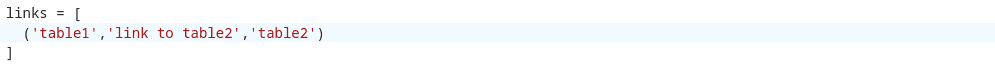
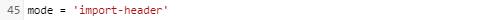

Vous souhaitez déplacer vos bases Airtable vers SeaTable et vous avez peur de l'effort ? Pas de soucis! Même les bases avec des structures de données complexes et plusieurs milliers d'ensembles de données peuvent être rapidement transférées vers SeaTable.

Nous avons développé un script de migration pour le transfert des données Airtable vers SeaTable. Celui-ci transfère toutes les données d'une base Airtable - tables, colonnes, enregistrements - en une seule fois vers une base SeaTable. Après la migration, vous pouvez continuer à utiliser dans SeaTable les données que vous avez utilisées en dernier dans Airtable. Après l'exécution du script, seules quelques retouches sont nécessaires.

Tout le monde – techniciens et non-techniciens – peut utiliser le script. Seuls quelques **détails manuels** sont nécessaires pour rendre le script opérationnel. Dans cet article, nous expliquons comment procéder.



## Comment migrer une base d'Airtable vers SeaTable

### 1\. créer une base

Créez une [nouvelle Base]() dans SeaTable. Le nom de la Base SeaTable ne doit pas nécessairement correspondre au nom de la Base Airtable à importer. Vous pouvez choisir librement le nom.

### 2\. insérer le script

Dans la nouvelle base, ouvrez la [barre latérale du script]() en cliquant sur l'icône du script dans l'en-tête de base en haut à droite. Sélectionnez ensuite **Ajouter un script** . Le script de migration est écrit dans le langage de programmation Python. Par conséquent, sélectionnez **Python** .

Sélectionnez maintenant le bloc de code suivant, copiez-le dans le presse-papier, puis collez-le dans la fenêtre gauche de l'éditeur de scripts :

```
## Parameterize the script

# SeaTable - Destination
server_url = 'https://cloud.seatable.io'
api_token = '...'
# Add an API token of the SeaTable base
# See https://seatable.io/docs/en/seatable-api/erzeugen-eines-api-tokens/
# for more information on how to create a SeaTable API token

# Airtable - Source
airtable_personal_access_token = '...'
# Add a Personal Access Token (PAT)
# PATs are 82-character strings and begin with "pat" (e.g. 'pat544WlSOq6T4Fvv.5710af6611aedbf28493c38084163494e02b24f078cf2d62f07105982a82a64d')
# See https://support.airtable.com/docs/creating-personal-access-tokens/
# for more information on how to create a PAT in Airtable

airtable_base_id = '...'
# Add the Base ID of the Airtable base
# Base IDs are alphanumeric strings and begin with "app" (e.g. 'appRfA3qspH3EJUnV')
# See https://support.airtable.com/docs/finding-airtable-ids/
# for more information on where to find the id of an Airtable base

table_names = ['...', '...']
# Add the names of all tables of the Airtable base, i.e. ['table 1', 'table 2']
# The names must be enclosed in '' and comma-separated

first_columns = [
   ('...', '...'),
   ('...', '...'),
]
# Specify the names of the first columns in every table of the Airtable base
# Use the format ('table_name', 'first_column_name'), i.e. ('table 1', 'ID')
# The table and column name must be enclosed in '' and comma-separated

links = [
]
# Specify the links between the tables in the Airtable base
# Use the format ('table_name', 'column_name', 'other_table_name'), i.e., ('table 1', 'link to table 2', 'table 2')
# The table and column names must be enclosed in '' and comma-separated
# If the Airtable base contains no link columns, just leave the brackets empty

from seatable_api.constants import ColumnTypes
excluded_column_types = [
    ColumnTypes.FILE
]
# Specify the column types which are to be excluded from the data import when running the script in import-rows mode (excluded column types are still created in import-header mode)
# Use the constants from https://developer.seatable.io/scripts/python/objects/constants/, i.e. ColumnTypes.FILE to exclude file columns
# The specified column types must be comma-separated
# If no column types are to be excluded, just leave the brackets empty
# ColumnTypes.LINK_FORMULA are always excluded

excluded_columns = []
# Specify the names of the columns which are to be excluded from the data import when running script in import-rows mode (excluded columns are still created in import-header mode)
# Use the format ('table_name', 'column_name'), i.e. ('table 1', 'column A')
# The table and column names must be enclosed in '' and comma-separated
# If no columns are to be excluded, just leave the brackets empty

mode = 'import-header'
# Specify the run-mode of the script, two options: 'import-header' and 'import-rows'
# Run 'import-header' first to create the data structure in the SeaTable base
# Run 'import-rows' to import all the rows


## No more edits required beyond this row

import sys
from seatable_api import Base, AirtableConvertor

def get_convertor():
    base = Base(api_token, server_url)
    base.auth()
    convertor = AirtableConvertor(
        airtable_api_key=airtable_personal_access_token,
        airtable_base_id=airtable_base_id,
        base=base,
        table_names=table_names,
        first_columns=first_columns,
        links=links,
    )
    return convertor

def import_header():
    convertor = get_convertor()
    convertor.convert_metadata()

def import_rows():
    convertor = get_convertor()
    convertor.convert_data()

if mode == 'import-header':
   import_header()

elif mode == 'import-rows':
   import_rows()

else:
   print('The mode is not properly specified.')

## End script
##
```

Ne vous inquiétez pas si vous ne comprenez pas le code que vous venez de copier. Nous vous l'expliquons. Les commentaires dans le code devraient aider un peu à l'interprétation. Les commentaires sont toutes les lignes précédées d'un signe dièse ('#'). Ces lignes ne sont pas prises en compte lors de l'exécution du script, ce qui signifie que vous pouvez modifier, supprimer ou même ajouter des commentaires sans influencer la fonctionnalité du script.

Contrairement aux commentaires, les indentations dans le code sont très importantes lors de l'exécution du script. Ne les modifiez pas.

### 3\. indiquer l'URL du serveur SeaTable et le jeton API de la base

Sous le commentaire **SeaTable – Destination** , collez l’URL du serveur SeaTable et fournissez le [jeton API](https://seatable.io/fr/docs/seatable-api/erzeugen-eines-api-tokens/) . Le jeton API doit accorder des autorisations de lecture et d'écriture. Si vous utilisez SeaTable Cloud, alors l'URL pré-remplie « https://cloud.seatable.io » est correcte. Si vous utilisez un autre serveur SeaTable, saisissez son URL. (L'URL doit toujours être saisie avec https:// ou http://.) L'URL et le jeton doivent être placés entre guillemets simples.

Ceci est un exemple de configuration pour importer les données dans une base dans SeaTable Cloud :  


### 4\. entrer le jeton d'accès personnel Airtable et l'ID de base

Complétez sous le commentaire **Airtable - Source** le site [Jeton d'accès personnel Airtable (PAT)](https://support.airtable.com/docs/creating-personal-access-tokens) ainsi que les [ID de la base aérienne](https://support.airtable.com/docs/finding-airtable-ids)Les deux valeurs sont à nouveau entre guillemets simples. Le PAT doit disposer de l'autorisation `data.records:read` et `schema.bases:read` décret.

Voilà à quoi cela devrait ressembler, vos valeurs étant bien sûr différentes :  


Utilisez les liens de documentation Airtable dans le script pour savoir où obtenir le PAT et l'ID de base.

### 5\. inscrire les noms des tableaux et des colonnes

Indiquez maintenant au script quelles tables vous souhaitez importer depuis Airtable Base. Faites-le dans la ligne "table_names". Ajoutez les noms des tables entre crochets, entre guillemets simples et séparés par une virgule.

Pour une base avec deux tableaux "table1" et "table2", la ligne doit alors ressembler par exemple à ceci :  


Si votre Airtable Base a plus de deux tableaux, prolongez simplement l'énumération entre parenthèses. Si vous ne souhaitez pas transférer tous les tableaux d'une base, il suffit d'omettre les noms des tableaux qui ne doivent pas être copiés.

En raison d'une restriction de l'API Airtable, vous devez également indiquer les noms des premières colonnes dans les tableaux. Cela se fait dans la ligne "first_columns" ou dans les lignes suivantes.

Pour l'Airtable Base avec les deux tables "table1" et "table2", cela pourrait alors ressembler à ceci :  


### 6\. définir des colonnes de liens

Pour que SeaTable puisse importer correctement les données, une étape supplémentaire est nécessaire : la spécification des [colonnes de liaison]() dans la base Airtable.

La variable "links" est prévue à cet effet. Par exemple, si la colonne "link to table2" dans la table "table1" représente un lien avec la table "table 2", le script doit être paramétré comme suit :



Vous ne devez spécifier chaque paire de colonnes de liens qu'une seule fois. Vous ne devez pas spécifier le lien dans les deux sens.

Si la Airtable Base ne reçoit pas de colonnes de liens, vous pouvez alors laisser les crochets vides :  


### 7\. exclure des colonnes ou des types de colonnes (facultatif)

Si vous ne souhaitez pas copier toutes les colonnes ou types de colonnes d'Airtable vers SeaTable, vous pouvez les exclure. L'exclusion d'une colonne ou d'un type de colonne garantit que la colonne est créée dans la base SeaTable, mais que les données qu'elle contient ne sont pas transférées. En excluant les colonnes contenant de très grandes quantités de données - et nous pensons notamment aux colonnes de fichiers - vous pouvez réduire considérablement le temps d'exécution du script. Surtout pour un test de migration, il est judicieux d'exclure les colonnes contenant des volumes de données élevés.

Les types de colonnes peuvent être exclus à l'aide de la variable « exclusive_column_types ». Pour spécifier les types de colonnes à exclure, utilisez les constantes Python fournies. Des colonnes individuelles peuvent être exclues à l'aide de la variable « exclusive_columns ». La spécification est analogue à la variable « first_columns » au format (« nom de la table », « nom de la colonne »). Si vous souhaitez exclure plusieurs colonnes, les valeurs doivent être séparées par des virgules.

### 8\. importer des tableaux et des colonnes

Le script peut être exécuté en deux modes : "import-header" et "import-rows". Tout d'abord, le script doit toujours être exécuté en mode "import-header". Dans ce mode, les tables et les colonnes sont créées dans la base SeaTable et 10 lignes de test sont importées.

Le mode d'exécution est défini dans la variable du même nom :  


Exécutez maintenant le script en cliquant sur **Exécuter le script**. Pendant l'exécution, vous voyez sur le côté droit dans l'éditeur les étapes effectuées. En arrière-plan, vous pouvez également voir comment les tableaux et les colonnes sont créés.



### 9\. vérifier les lignes de test

Vérifiez maintenant si

- tous les tableaux et toutes les colonnes ont été importés
- la première colonne correcte a été créée dans tous les tableaux et que
- les colonnes de liaison sont correctes.

Comme les types de colonnes d'Airtable et de SeaTable ne sont pas totalement congruents, certains types de colonnes de la base SeaTable seront différents de ceux de la base Airtable. Le tableau suivant montre comment les types de colonnes d'Airtable sont transférés dans SeaTable.

| **Airtable Type de colonne**      | **Importation dans SeaTable Type de colonne** |
| --------------------------------- | --------------------------------------------- |
| Attachment                        | Fichier                                       |
| Numéro de voiture                 | Texte                                         |
| Code à barres                     | Texte                                         |
| Bouton                            | \-                                            |
| Case à cocher                     | Case à cocher                                 |
| Comte                             | \-                                            |
| Créé par                          | Texte                                         |
| Heure de création                 | Date                                          |
| Monnaie                           | Nombre                                        |
| Date                              | Date                                          |
| Duration                          | Durée                                         |
| Courriel :                        | Courriel :                                    |
| Formule                           | Formule (avec formule d'espace réservé)       |
| Dernière modification par         | Texte                                         |
| Dernière heure modifiée           | Date                                          |
| Lien vers un autre enregistrement | Lien vers d'autres entrées                    |
| Texte long                        | Texte formaté                                 |
| Rechercher                        | \-                                            |
| Sélection multiple                | Sélection multiple                            |
| Numéro                            | Nombre                                        |
| Pourcentage                       | Nombre                                        |
| Numéro de téléphone               | Texte                                         |
| Rating                            | Rating                                        |
| Rollup                            | \-                                            |
| Texte à ligne unique              | Texte                                         |
| Single select                     | Sélection unique                              |
| Utilisateur                       | Texte                                         |
| URL                               | URL                                           |

Les colonnes de formule et les types de colonnes Airtable Count, Lookup et Rollup jouent un rôle particulier. Pour le premier, une colonne de formule est créée dans la Base SeaTable avec le résultat « Formule à définir ». Malheureusement, il n'est actuellement pas possible de traduire automatiquement une formule Airtable en formule SeaTable. La situation est similaire avec les autres types de colonnes mentionnés. Ceux-ci ne sont pas créés automatiquement par le script. Les colonnes qui ne sont pas créées par le script sont répertoriées dans le tableau séparé « Colonnes à migrer manuellement ».

Si quelque chose ne va pas, supprimez les tables créées par le script et vérifiez les entrées des étapes 5 et 6. Exécutez ensuite à nouveau le script en mode « import-header ». Vous pouvez exécuter le script aussi souvent que vous le souhaitez.


### 10\. importer tous les enregistrements

Si vous êtes satisfait du contrôle effectué à l'étape 9, tous les enregistrements de données peuvent être transférés.

Dans le script, changez le mode de "import-header" en "import-rows" :


Exécutez à nouveau le script en cliquant sur **Exécuter le script**. Vous pouvez à nouveau observer l'exécution du script sur le côté droit et voir l'activité en arrière-plan.




Vous devriez maintenant voir tous les enregistrements de la base Airtable dans la nouvelle base SeaTable. Félicitations, la migration des enregistrements est terminée !

Si vous n'êtes pas satisfait du résultat final, [supprimez toutes les tables]() et recommencez à partir de l'étape 5.

### 11\. terminer la migration

Le script de migration a transféré toutes les données. Certaines retouches manuelles peuvent maintenant être nécessaires.

D'une part, il faut ajouter les formules dans les colonnes de formules et ajouter les colonnes qui n'ont pas été créées automatiquement et qui sont listées dans le tableau « Colonnes à migrer manuellement ».

D'un autre côté, vous devez également créer vous-même des vues, car celles-ci ne sont pas transférées depuis la base Airtable. Il en va de même pour les automatisations, les interfaces et les scripts.

## Section FAQ

Non, le script lit uniquement votre Airtable Base. Les données de la base Airtable ne sont pas modifiées.


Un message d'erreur lors de la première exécution n'est pas du tout improbable. Il y a suffisamment de raisons pour cela, par exemple un jeton erroné, un ordre incorrect dans la spécification des liens, des fautes de frappe, des virgules manquantes ou une indentation incorrecte. Une seule erreur peut entraîner l'arrêt de l'exécution du script.  
Si vous recevez un message d'erreur, ce n'est en principe pas un problème. Aucune donnée ne peut être perdue. Procédez comme suit pour trouver la cause de l'erreur :

- Dans la plupart des cas, le message d'erreur vous donne une indication sur l'endroit où se trouve l'erreur. Suivez-le, corrigez les paramètres saisis et exécutez à nouveau le script. Une erreur d'indentation, par exemple, indique que l'indentation n'est pas conforme à la syntaxe Python.
- Si le message d'erreur est incompréhensible, vérifiez que toutes les données saisies sont correctes et essayez à nouveau.
- Si aucun de ces conseils ne vous aide, demandez de l'aide au [Forum SeaTable](https://forum.seatable.com/).

> **Remarque importante**: Veuillez supprimer les jetons API, le PAT et l'ID de base avant de poster des captures d'écran ou des scripts sur le forum.



En principe, oui. La procédure présentée dans cet article avec l'éditeur Python intégré est toutefois soumise à une limite maximale d'exécution de 15 minutes, ce qui signifie que les scripts qui s'exécutent pendant plus de 15 minutes sont interrompus. Dans la pratique, cela est suffisant pour la grande majorité des bases. Pour les bases avec des fichiers joints importants/nombreux, cette limite peut toutefois jouer un rôle. Dans ce cas, vous pouvez réduire la durée d'exécution en excluant des colonnes. Si vous ne voulez pas exclure les colonnes, vous devez exécuter le script Python localement sur un ordinateur qui n'a pas de limite de temps d'exécution.


Le script n'exige pas qu'une base soit vide. Vous pouvez donc aussi exécuter le script dans une base avec des tables existantes et remplies. La seule chose à éviter est la duplication des noms de table.


