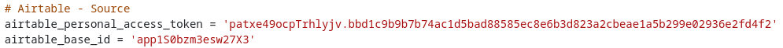
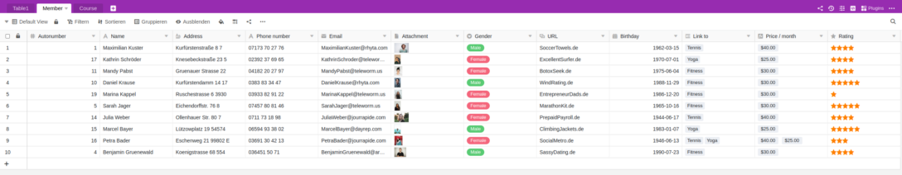

Quer mudar as suas Airtable Bases para SeaTable e tem medo do esforço? Não se preocupe! Mesmo as bases com estruturas de dados complicadas e muitos milhares de registos de dados podem ser rapidamente transferidas para o SeaTable.

Desenvolvemos um script de migração para a transferência de dados do Airtable para o SeaTable. Este script transfere todos os dados de uma base Airtable - tabelas, colunas, registos de dados - para uma base SeaTable de uma só vez. Após a migração, pode continuar no SeaTable com os dados que utilizou pela última vez no Airtable. Após a execução do script, são necessários apenas alguns ajustes.

O guião pode ser utilizado por qualquer pessoa - técnicos e não técnicos. Apenas são necessárias algumas **entradas manuais** para que o script esteja pronto a ser utilizado. Neste artigo, explicamos como o fazer.



## Como migrar uma base do Airtable para o SeaTable

### 1\. criar uma base

Criar uma [nova base]() no SeaTable. O nome da base SeaTable não tem de corresponder ao nome da base Airtable a ser importada. Pode escolher o nome livremente.

### 2\. inserir guião

 Na nova Base, abra a [barra lateral de scripts]() clicando no ícone de script no cabeçalho da Base, no canto superior direito. Em seguida, selecione **Adicionar script**. O script de migração é escrito na linguagem de programação Python. Portanto, selecione **Python**.

Agora, realce o seguinte bloco de código, copie-o para a área de transferência e cole-o na janela do lado esquerdo do editor de scripts:

```
## Parameterize the script

# SeaTable - Destination
server_url = 'https://cloud.seatable.io'
api_token = '...'
# Add an API token of the SeaTable base

# Airtable - Source
airtable_personal_access_token = '...'
# Add a Personal Access Token (PAT)
# PATs are 82-character strings and begin with "pat" (e.g. 'pat544WlSOq6T4Fvv.5710af6611aedbf28493c38084163494e02b24f078cf2d62f07105982a82a64d')
# See https://support.airtable.com/docs/creating-personal-access-tokens/
# for more information on how to create a PAT in Airtable

airtable_base_id = '...'
# Add the Base ID of the Airtable base
# Base IDs are alphanumeric strings and begin with "app" (e.g. 'appRfA3qspH3EJUnV')
# See https://support.airtable.com/docs/finding-airtable-ids/
# for more information on where to find the id of an Airtable base

table_names = ['...', '...']
# Add the names of all tables of the Airtable base, i.e. ['table 1', 'table 2']
# The names must be enclosed in '' and comma-separated

first_columns = [
   ('...', '...'),
   ('...', '...'),
]
# Specify the names of the first columns in every table of the Airtable base
# Use the format ('table_name', 'first_column_name'), i.e. ('table 1', 'ID')
# The table and column name must be enclosed in '' and comma-separated

links = [
]
# Specify the links between the tables in the Airtable base
# Use the format ('table_name', 'column_name', 'other_table_name'), i.e., ('table 1', 'link to table 2', 'table 2')
# The table and column names must be enclosed in '' and comma-separated
# If the Airtable base contains no link columns, just leave the brackets empty

from seatable_api.constants import ColumnTypes
excluded_column_types = [
    ColumnTypes.FILE
]
# Specify the column types which are to be excluded from the data import when running the script in import-rows mode (excluded column types are still created in import-header mode)
# Use the constants from https://developer.seatable.io/scripts/python/objects/constants/, i.e. ColumnTypes.FILE to exclude file columns
# The specified column types must be comma-separated
# If no column types are to be excluded, just leave the brackets empty
# ColumnTypes.LINK_FORMULA are always excluded

excluded_columns = []
# Specify the names of the columns which are to be excluded from the data import when running script in import-rows mode (excluded columns are still created in import-header mode)
# Use the format ('table_name', 'column_name'), i.e. ('table 1', 'column A')
# The table and column names must be enclosed in '' and comma-separated
# If no columns are to be excluded, just leave the brackets empty

mode = 'import-header'
# Specify the run-mode of the script, two options: 'import-header' and 'import-rows'
# Run 'import-header' first to create the data structure in the SeaTable base
# Run 'import-rows' to import all the rows


## No more edits required beyond this row

import sys
from seatable_api import Base, AirtableConvertor

def get_convertor():
    base = Base(api_token, server_url)
    base.auth()
    convertor = AirtableConvertor(
        airtable_api_key=airtable_personal_access_token,
        airtable_base_id=airtable_base_id,
        base=base,
        table_names=table_names,
        first_columns=first_columns,
        links=links,
    )
    return convertor

def import_header():
    convertor = get_convertor()
    convertor.convert_metadata()

def import_rows():
    convertor = get_convertor()
    convertor.convert_data()

if mode == 'import-header':
   import_header()

elif mode == 'import-rows':
   import_rows()

else:
   print('The mode is not properly specified.')

## End script
##
```

Não se preocupe se não compreender o código que acabou de copiar. Nós explicamo-lo. Os comentários no código devem ajudar um pouco na interpretação. Os comentários são todas as linhas com um sinal de hash ('#') à esquerda. Estas linhas são ignoradas quando o script é executado, ou seja, pode alterar, apagar ou adicionar comentários sem afetar a funcionalidade do script.

Ao contrário dos comentários, as indentações no código são muito importantes quando se executa o script. Por favor, não as altere.

### 3\. especificar o URL do servidor SeaTable e o token da API da base

Adicione o URL do servidor SeaTable no comentário **SeaTable - Destination** e introduza o [token da API](). O token da API deve conceder permissões de leitura e gravação. Se estiver a utilizar o SeaTable Cloud, então o URL pré-preenchido "https://cloud.seatable.io" está correto. Se estiver a utilizar um servidor SeaTable diferente, introduza o respetivo URL. (O URL deve ser sempre introduzido com https:// ou http://.) O URL e o token devem ser colocados entre aspas simples.

Este é um exemplo de configuração para importar dados para uma base no SeaTable Cloud:  


### 4\. introduzir o Airtable Personal Access Token e a Base ID

Adicionar abaixo do comentário **Airtable - Fonte** a [Token de acesso pessoal (PAT) Airtable](https://support.airtable.com/docs/creating-personal-access-tokens) e o [ID da base aérea](https://support.airtable.com/docs/finding-airtable-ids)ambos os valores novamente entre aspas simples. O PAT deve ter a autorização `data.records:read` e `schema.bases:read` disponível.

Este é o aspeto que deve ter, embora os seus valores sejam, naturalmente, diferentes:  


Utilize as ligações no script para a documentação do Airtable para saber onde pode obter o PAT e o ID da base.

### 5\. Introduzir os nomes das tabelas e colunas

Agora, indique ao script quais as tabelas que pretende importar da Airtable Base. Faça isso na linha "table_names". Adicione os nomes das tabelas entre parêntesis rectos - cada um entre uma única vírgula invertida e separado por uma vírgula.

Para uma base com as duas tabelas "table1" e "table2", a linha deve então ter o seguinte aspeto, por exemplo:  


Se a sua base de mesa aérea tiver mais de duas tabelas, basta aumentar a lista entre parênteses. Se não pretender transferir todas as tabelas de uma base, basta omitir os nomes das tabelas que não devem ser copiadas.

Devido a uma limitação da API do Airtable, deve também especificar os nomes das primeiras colunas das tabelas. Isto é feito na linha "first_columns" ou nas linhas seguintes.

No caso da Base Airtable com as duas tabelas "table1" e "table2", o resultado poderia ser o seguinte:  


### 6\. definir colunas de ligação

Para que o SeaTable importe os dados corretamente, é necessário mais um passo: a especificação das [colunas de ligação]() na Airtable Base.

A variável "links" destina-se a este fim. Por exemplo, se a coluna "link to table2" da tabela "table1" representar uma ligação à tabela "table 2", o guião deve ser parametrizado da seguinte forma


Só é necessário especificar uma vez cada par de colunas de ligação. Não é necessário especificar a ligação em ambas as direcções.

Se a base da mesa aérea não receber quaisquer colunas de ligação, pode deixar o parêntesis quadrado vazio:  


### 7\. excluir colunas ou tipos de colunas (opcional)

Se não quiser copiar todas as colunas ou tipos de colunas do Airtable para o SeaTable, pode excluí-las. A exclusão de uma coluna ou tipo de coluna garante que a coluna é criada no SeaTable Base, mas os dados que contém não são transferidos. Ao excluir colunas com grandes quantidades de dados - e estamos a pensar em particular nas colunas de ficheiros - pode reduzir significativamente o tempo de execução do script. A exclusão de colunas com um grande volume de dados é particularmente útil para um teste de migração.

Os tipos de colunas podem ser excluídos através da variável "excluded_column_types". Para especificar os tipos de colunas a excluir, utilize as constantes Python fornecidas para o efeito. As colunas individuais podem ser excluídas através da variável "excluded_columns". A especificação é análoga à variável "first_columns" no formato ('nome da tabela', 'nome da coluna'). Se se pretender excluir várias colunas, os valores devem ser separados por vírgulas.

### 8\. importar tabelas e colunas

O script pode ser executado em dois modos: "import-header" e "import-rows". Em primeiro lugar, o script deve ser sempre executado no modo "import-header" (importar cabeçalho). Neste modo, as tabelas e colunas são criadas no SeaTable Base e são importadas 10 linhas de teste.

O modo de execução é definido através da variável com o mesmo nome:  


Agora, execute o script clicando em **Executar script**. Enquanto o script está a ser executado, pode ver as etapas que foram executadas no lado direito do editor. Em segundo plano, também pode ver como as tabelas e colunas são criadas.



### 9\. verificar as linhas de ensaio

Agora verifique se

- todas as tabelas e todas as colunas foram importadas,
- a primeira coluna correcta foi criada em todas as tabelas e
- as colunas de ligação estão correctas.

Como os tipos de coluna do Airtable e do SeaTable não são completamente congruentes, alguns tipos de coluna na Base do SeaTable serão diferentes dos da Base do Airtable. A tabela a seguir mostra como os tipos de coluna no Airtable são transferidos para o SeaTable.

| **Tipo de coluna de mesa de ar** | **Importar para o SeaTable Tipo de coluna**  |
| -------------------------------- | -------------------------------------------- |
| Anexo                            | Ficheiro                                     |
| Número automático                | Texto                                        |
| Código de barras                 | Texto                                        |
| Botão                            | \-                                           |
| Caixa de verificação             | Caixa de verificação                         |
| Contagem                         | \-                                           |
| Criado por                       | Texto                                        |
| Tempo de criação                 | Data                                         |
| Moeda                            | Número                                       |
| Data                             | Data                                         |
| Duração                          | Duração                                      |
| Email                            | Correio electrónico                          |
| Fórmula                          | Fórmula (com fórmula de marcador de posição) |
| Última modificação por           | Texto                                        |
| Última modificação               | Data                                         |
| Ligação a outro registo          | Ligação a outras entradas                    |
| Texto descritivo                 | Texto formatado                              |
| Consulta                         | \-                                           |
| Seleção múltipla                 | Selecção múltipla                            |
| Número                           | Número                                       |
| Percentagem                      | Número                                       |
| Número de telefone               | Texto                                        |
| Classificação                    | Classificação                                |
| Rollup                           | \-                                           |
| Texto de uma linha               | Texto                                        |
| Seleção única                    | Selecção única                               |
| Utilizador                       | Texto                                        |
| URL                              | URL                                          |

As colunas de fórmula e os tipos de coluna Airtable Count, Lookup e Rollup desempenham um papel especial. Para o primeiro, uma coluna de fórmula com o resultado "Fórmula a ser definida" é criada no SeaTable Base. Infelizmente, atualmente não é possível traduzir automaticamente uma fórmula do Airtable para uma fórmula do SeaTable. A situação é semelhante com os outros tipos de colunas mencionados. Estes não são criados automaticamente pelo script. As colunas que não são criadas pelo script estão listadas na tabela separada "Colunas a serem migradas manualmente".

Se algo não estiver correto, elimine as tabelas criadas pelo script e verifique as entradas nos passos 5 e 6. Em seguida, execute novamente o script no modo "import-header". Pode executar o script as vezes que quiser.



### 10\. importar todos os registos de dados

Se estiver satisfeito com a verificação no passo 9, todos os registos de dados podem ser transferidos.

No script, altere o modo de "import-header" para "import-rows":


Execute o script novamente, clicando em **Executar Script**. Mais uma vez, pode observar a execução do script no lado direito e ver as actividades em segundo plano.




Agora deve ver todos os registos da Airtable Base na nova SeaTable Base. Parabéns, a migração dos conjuntos de dados está concluída!

Se não estiver satisfeito com o resultado final, [apague todas as tabelas]() e recomece no passo 5.

### 11\. finalizar a migração

O script de migração transferiu todos os dados. Poderá ainda ser necessário algum trabalho manual.

Em primeiro lugar, é necessário adicionar as fórmulas nas colunas de fórmulas e adicionar as colunas que não foram criadas automaticamente e que constam da tabela "Colunas a migrar manualmente".

Por outro lado, também é necessário criar vistas, uma vez que estas não são transferidas da Airtable Base. O mesmo se aplica às automatizações, interfaces e scripts.

## Área de FAQ

Não. O script apenas lê a sua base de mesa aérea. Os dados na base da tabela aérea não são alterados.


Uma mensagem de erro na primeira execução não é de todo improvável. Há muitas razões para isso, por exemplo, um token incorreto, uma sequência incorrecta na especificação das ligações, erros de digitação, falta de vírgulas ou indentação incorrecta. Um único erro pode levar à anulação da execução do script.  
Se receber uma mensagem de erro, geralmente não se trata de um problema. Não se perdem dados. Proceda da seguinte forma para encontrar a causa do erro:

- Na maioria dos casos, a mensagem de erro dá-lhe uma pista sobre onde encontrar o erro. Siga-a, corrija os parâmetros introduzidos e execute o script novamente. Um erro de indentação, por exemplo, indica que a indentação não corresponde à sintaxe Python.
- Se a mensagem de erro for incompreensível, verifique se todas as entradas estão correctas e tente novamente.
- Se nenhuma das dicas ajudar, procure ajuda no [Fórum SeaTable](https://forum.seatable.com/).

> **Nota importante**: Remova o token da API, o PAT e a ID de base antes de publicar capturas de ecrã ou scripts no fórum.



Em princípio, sim. No entanto, o procedimento apresentado neste artigo com o editor Python integrado está sujeito a um limite máximo de tempo de execução de 15 minutos, ou seja, os scripts que se prolongam por mais de 15 minutos são cancelados. Na prática, isto é suficiente para a grande maioria das bases. No entanto, este limite pode ter um papel importante para bases com ficheiros grandes/muitos anexos. Neste caso, pode reduzir o tempo de execução excluindo colunas. Se não pretender excluir colunas, deve executar o script Python localmente num computador onde não exista limite de tempo de execução.


O script não requer que a base esteja vazia. Por isso, também pode executar o script numa base com tabelas existentes e preenchidas. A única coisa que deve evitar é duplicar os nomes das tabelas.

