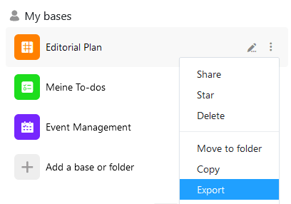

Puedes exportar una base como archivo DTABLE en cualquier momento y guardar así una copia de seguridad completa en tu dispositivo. Puedes descubrir cómo funciona y qué debes tener en cuenta en el siguiente artículo.

## Para exportar una base

1. Vaya a la **página de inicio** de SeaTable.
2. Mueva el puntero del ratón hasta el nombre de la **base** que desea exportar y haga clic en el **icono de tres puntos** que aparece en el extremo derecho.
3. Seleccione la opción **Exportar**.

Dependiendo de la configuración de su navegador, la **descarga** se iniciará automáticamente o se le preguntará dónde desea guardar el archivo de exportación. Si es necesario, seleccione un **lugar de almacenamiento** adecuado y confirme la selección.

En cuanto su archivo con la extensión **.dtable** aparezca en la ubicación de almacenamiento especificada, la exportación de la base se habrá completado.

{{< warning  headline="Nota"  text="Tenga en cuenta que el **archivo DTABLE** puede llegar a ser muy **grande** si ha hecho un uso extensivo de columnas de archivos e imágenes en la base exportada. En SeaTable Cloud se pueden exportar bases con un **tamaño máximo de hasta 100 MB**. Puede utilizar el [administrador de archivos](https://seatable.io/es/docs/dateien-und-bilder/das-dateimanagement-einer-base/) para **eliminar los archivos adjuntos** en las bases que superen este límite de tamaño para permitir la exportación." />}}

## ¿Qué almacena un archivo DTABLE?

El archivo DTABLE exportado contiene el estado actual de su base incluyendo todos los

- Tablas y vistas,
- Filas, columnas y valores,
- Imágenes y archivos,
- Formularios web,
- Estadísticas,
- Guiones,
- Plugins y
- Aplicaciones.



## Restaurar una base a partir de un archivo DTABLE

Puede **importar** un archivo DTABLE a SeaTable como nueva base en cualquier momento. Puede obtener más información sobre este tema en el artículo [Creación de una base a partir de un archivo DTABLE](https://seatable.io/es/docs/import-von-daten/erstellen-einer-base-aus-einer-dtable-datei/).
