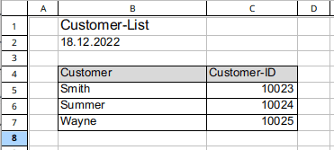

SeaTable vous permet d'**importer** des fichiers **CSV** et **Excel (.xlsx)** dans vos bases. Pour que l'importation des données se déroule comme prévu et qu'aucune donnée ne soit perdue, nous avons résumé pour vous les principaux **conseils et astuces** lors de l'importation de fichiers CSV ou XLSX. Si vous suivez ces conseils et astuces, vous réussirez à importer vos données dans SeaTable :

- Importer uniquement des structures de tableau
- Créer la structure du tableau dans SeaTable avant l'importation
- Diviser l'importation
- Assurer la qualité des données
- Contrôler l'importation

## Importez uniquement des structures de tableau

Il arrive souvent que des problèmes surviennent lors de l'importation de fichiers Excel lorsque ceux-ci contiennent **des structures** et des contenus **qui n'appartiennent pas au tableau**. Le graphique suivant illustre un tel cas. L'en-tête, la date et les colonnes A et D ne font pas partie du tableau et doivent être supprimés avant l'importation.

**Les graphiques** ne sont pas non plus pris en compte lors d'une importation et doivent donc être supprimés avant la tentative d'importation.

## Créez la structure du tableau dans SeaTable avant l'importation

Lorsque SeaTable importe une liste Excel, il tente de déterminer le **type de colonne** à créer en fonction des **données importées**. Des problèmes surviennent inévitablement chaque fois que SeaTable détermine mal le type de colonne et que les données ne sont pas compatibles avec le type de colonne. Par exemple, si SeaTable reconnaît un nombre et crée donc une colonne de nombre, les textes et les mots de cette colonne ne peuvent plus être importés et les cellules restent identiques.

Même si la reconnaissance des colonnes fonctionne généralement de manière fiable, vous pouvez facilement éviter que ce problème ne se produise. Au lieu de faire créer une nouvelle base par importation, créez d'abord vous-même la base avec toutes les colonnes du tableau et importez ensuite uniquement le contenu.


Il n'est pas possible d'importer des données dans le type de colonne **Lien vers d'autres entrées**. Cependant, après l'importation, vous pouvez utiliser l'opération de traitement des données [Comparer et lier]() pour créer des liens entre certains enregistrements.


## Diviser l'importation

La fonction d'importation de SeaTable peut importer des fichiers Excel contenant **plusieurs feuilles de calcul** et **des dizaines de milliers de lignes**. L'expérience montre toutefois que plus vous essayez d'importer de données d'un coup, plus il est probable que des problèmes surviennent.

Essayez donc, chaque fois que c'est possible, de diviser l'importation en **petits paquets de données**. Importez plutôt les feuilles de calcul séparément et l'une après l'autre et divisez les grands tableaux en petits tableaux. Vous aurez ainsi un meilleur contrôle sur l'importation et vous serez heureux de disposer de données importées dans leur intégralité.

## Assurez la qualité des données

La **préparation des données** est essentielle pour une importation sans problème. Avant d'importer des fichiers CSV ou XLSX dans une base, vous devez toujours vous assurer que les données ont été nettoyées et qu'elles répondent aux exigences d'importation. Vous pouvez lire quelles sont les **limites** concernant les données lors de l'importation CSV ou Excel dans l'article d'aide correspondant [Limites lors de l'importation CSV/Excel]().

## Contrôlez l'importation

Chaque importation de données s'accompagne toujours d'un **contrôle de réussite**. Ne vous fiez pas au fait que tout a fonctionné parce que vous ne recevez pas de messages d'erreur. Vérifiez que les données importées **sont complètes** et **exemptes d'erreurs** avant de commencer à les traiter.
