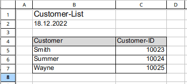

No SeaTable tem a opção de **importar** tanto **ficheiros** **CSV** como **Excel (.xlsx)** para as suas bases. Para garantir que tudo corre de acordo com o planeado durante a importação de dados e que não se perdem dados, resumimos as **dicas e truques** mais importantes para importar ficheiros CSV ou XLSX para si. Se seguir estas dicas e truques, importará com sucesso os seus dados para o SeaTable:

- Importar apenas estruturas de mesa
- Criar a estrutura da mesa em SeaTable antes da importação
- Dividir a importação
- Assegurar a qualidade dos dados
- Controlar a importação

## Importar apenas estruturas de mesa

Os problemas ocorrem frequentemente ao importar ficheiros Excel se estes contiverem **estruturas** e conteúdos que **não pertencem à tabela**. O gráfico seguinte mostra um caso desses. O cabeçalho, a data e as colunas A e D não pertencem à tabela e devem ser removidas antes da importação.

Os **gráficos** também não são tidos em conta durante uma importação, pelo que devem ser eliminados antes da tentativa de importação.

## Criar a estrutura da mesa em SeaTable antes da importação

Quando o SeaTable importa uma lista Excel, tenta determinar que **tipo de coluna** criar com base nos **dados importados**. Os problemas surgem inevitavelmente sempre que o SeaTable determina incorrectamente o tipo de coluna e os dados não são compatíveis com o tipo de coluna. Por exemplo, se o SeaTable reconhece um número e por isso cria uma coluna de números, os textos e palavras nesta coluna já não podem ser importados e as células permanecem as mesmas.

Mesmo que o reconhecimento da coluna funcione normalmente de forma fiável, pode facilmente evitar uma possível ocorrência deste problema. Em vez de ter uma nova base criada por importação, primeiro crie você mesmo a base com todas as colunas da tabela e depois importe apenas o conteúdo.

## Dividir a importação para

A função de importação do SeaTable pode importar ficheiros Excel com **múltiplas folhas de cálculo** e **dezenas de milhares de filas**. No entanto, a experiência mostra que quanto mais dados tentar importar de uma só vez, maior é a probabilidade de encontrar problemas.

Por conseguinte, sempre que possível, tente dividir a importação em **pacotes de dados mais pequenos**. Prefira importar as folhas de cálculo separadamente e uma após a outra e dividir as mesas grandes em mesas pequenas. Desta forma, tem um melhor controlo sobre a importação e fica satisfeito com os dados completamente importados no final.

## Assegurar a qualidade dos dados

A **preparação dos dados** é essencial para uma importação sem problemas. Antes de importar ficheiros CSV ou XLSX para uma base, deve sempre certificar-se de que os dados foram limpos e cumprem os requisitos de importação. Pode ler sobre as **limitações das** importações de CSV ou Excel no artigo de ajuda correspondente [Limitações das importações de CSV/Excel](https://seatable.io/pt/docs/import-von-daten/limitationen-beim-csv-excel-import/).

## Verificar a importação

Cada importação de dados inclui sempre uma **verificação de sucesso**. Não confie no facto de tudo ter funcionado apenas porque não recebe quaisquer mensagens de erro. Verifique se os dados importados **estão completos** e **isentos de erros** antes de iniciar o processamento.
