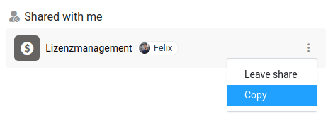

Sie möchten eine Ihrer **Bases** an einen anderen Benutzer übertragen? SeaTable bietet hierfür drei verschiedene Möglichkeiten kann, wobei sich das optimale Vorgehen darin unterscheidet, ob sich der empfangende Benutzer in Ihrem **eigenen Team**, in einem **fremden Team** oder vielleicht sogar auf einem **anderen SeaTable Server** befindet.

## Übertragung an einen Benutzer im eigenen Team

Diese Herausforderung lässt sich denkbar leicht meistern. Legen Sie eine **neue Gruppe** an und fügen Sie den anderen Benutzer als Gruppenmitglied hinzu. Als Nächstes können Sie Ihre **Base in die gemeinsame Gruppe kopieren** und schon hat der andere Benutzer Zugriff auf Ihre Base.

Diese Schritte kann **jedes Teammitglied** durchführen – unabhängig davon, ob Sie Administratorrechte innerhalb Ihres Teams haben oder nicht. Die folgenden Hilfeartikel werden Ihnen dabei helfen:

- [Eine neue Gruppe anlegen]()
- [Eine Base in eine Gruppe kopieren]()

## Übertragen einer Base an ein anderes Team

Wenn Sie eine Ihrer Bases an einen **Benutzer in einem anderen Team** übertragen wollen, werden Sie mit einer Gruppe _nicht_ weiterkommen, da Sie den anderen Benutzer nicht einladen können. Stattdessen können Sie das folgende Vorgehen wählen:

[Erstellen Sie einen Einladungs-Link]() zu Ihrer Base und schicken Sie diesen Link an den anderen Benutzer. Sobald der andere Benutzer die **Freigabe** akzeptiert hat, kann er die **Base kopieren** und in sein eigenes Team übernehmen.



## Migration einer Base auf einen anderen SeaTable Server

Für die Übertragung einer Base an einen anderen SeaTable Server gibt es nur eine Möglichkeit. **Exportieren** Sie die Base als **DTABLE-Datei** und schicken Sie diese an den Empfänger. Dieser kann die Datei wiederum in sein SeaTable System importieren und mit Ihrer Base weiterarbeiten.

- [Exportieren einer Base als DTABLE-Datei](https://seatable.io/docs/import-von-daten/speichern-einer-base-als-dtable-datei/)
- [Erstellen einer Base aus einer DTABLE-Datei](https://seatable.io/docs/import-von-daten/erstellen-einer-base-aus-einer-dtable-datei/)
