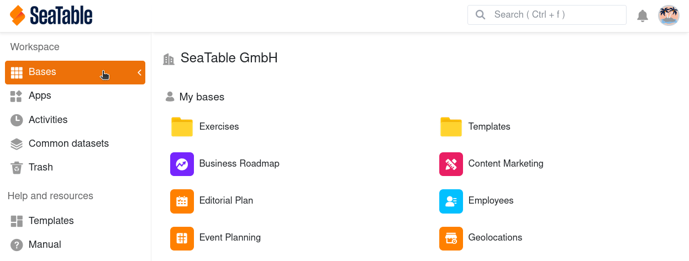
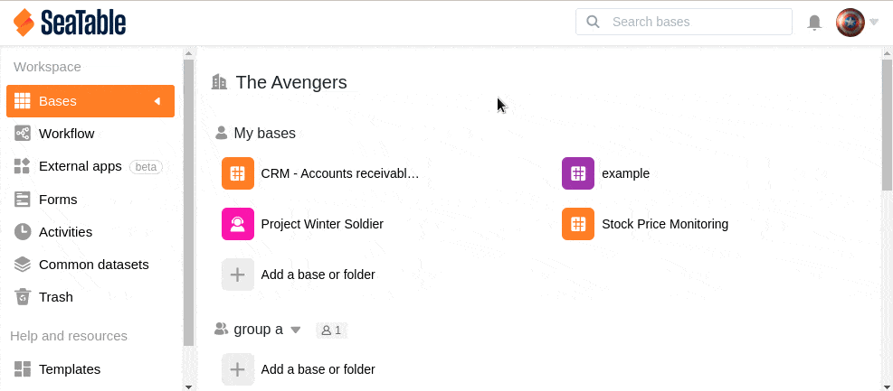

As bases que criou em "As minhas bases" ou em grupos podem ser eliminadas e, se necessário, restauradas a partir do respectivo caixote do lixo. Tenha em atenção que um restauro só é possível até um máximo de 30 dias após a eliminação de uma base. Após este período, as bases eliminadas são removidas permanentemente do SeaTable e já não podem ser restauradas.

## Restaurar uma base eliminada de Minhas Bases

1. Mudar para a **página inicial** da SeaTable.
2. Abrir o **caixote do lixo**.
3. Seleccione a **base** que pretende restaurar. Para o fazer, clicar no **nome da base** ou em **Restaurar** à direita da data de eliminação.
4. Confirmar a restauração clicando novamente em **Restaurar**.
5. Encontrará agora a base restaurada na página inicial em **As Minhas Bases**.

## Restaurar uma base eliminada de um grupo

As bases que foram eliminadas de um grupo **não podem** ser restauradas da forma descrita acima, uma vez que cada grupo tem o seu próprio **caixote do lixo**. Pode utilizar o caixote do lixo de um grupo para restaurar todas as bases do grupo que foram eliminadas nos últimos 30 dias.

1. Mudar para a **página inicial** da SeaTable.
2. Clique no **símbolo do triângulo** à direita do nome do grupo no qual a base eliminada estava localizada.
3. Abrir o **caixote do lixo**.
4. Seleccione a **base** que pretende restaurar. Para o fazer, clicar no **nome da base** ou em **Restaurar** à direita da data de eliminação.
5. Confirmar a restauração clicando novamente em **Restaurar**.
6. Encontrará agora a base restaurada no **grupo** correspondente na página inicial.
