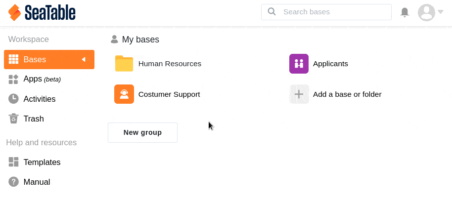
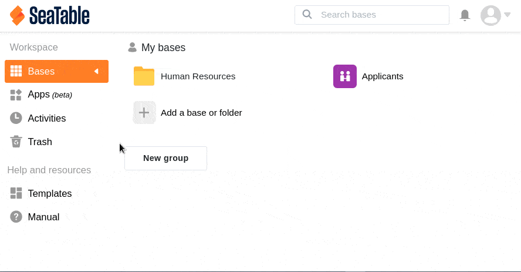

Ihre **eigenen Bases** können Sie in SeaTable jederzeit löschen. Bases, die zu einer **Gruppe** gehören, können Sie nur als Eigentümer oder Gruppen-Administrator löschen.

## Eine Base in SeaTable löschen

1. Wechseln Sie zur **Startseite** von SeaTable.
2. Fahren Sie mit dem Mauszeiger über die **Base**, die Sie löschen möchten.
3. Klicken Sie auf die **drei Punkte**, die ganz rechts erscheinen.
4. Klicken Sie auf **Löschen**.
5. Bestätigen Sie den Vorgang erneut mit **Löschen**.

Gelöschte Bases landen in einem **Papierkorb**. Von dort aus können Sie sie zunächst **wiederherstellen**. Wie das geht, erfahren Sie [hier]().



## Den Papierkorb leeren

Wenn Sie nicht warten möchten, bis die 30 Tage abgelaufen sind, können Sie Ihre eigenen Bases auch **manuell** endgültig löschen, indem Sie den **Papierkorb leeren**.

1. Wechseln Sie zur **Startseite** von SeaTable.
2. Öffnen Sie im Seitenmenü den **Papierkorb**, in dem Sie nun Ihre gelöschten Bases sehen.
3. Klicken Sie in der rechten oberen Ecke auf die Schaltfläche **Leeren**.
4. Bestätigen Sie den anschließenden Dialog erneut mit **Leeren**, um alle Bases zu entfernen.
