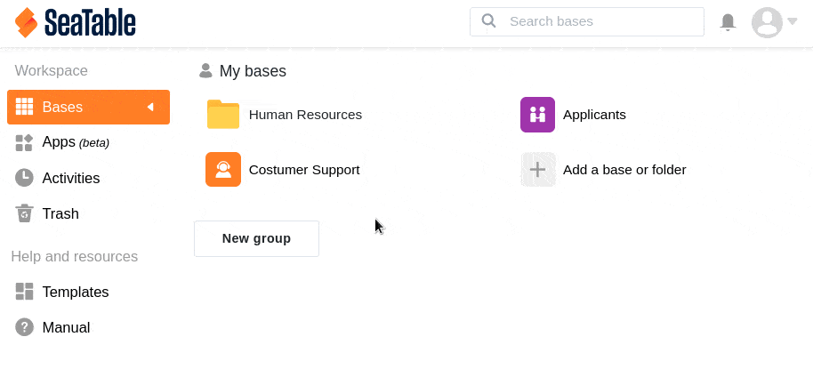

You can delete your **own bases** in SeaTable at any time. Bases that belong to a **group** can only be deleted as the owner or group administrator.

## Delete a base in SeaTable

1. Switch to the SeaTable **home page**.
2. Hover the mouse cursor over the **base** you want to delete.
3. Click on the **three dots** that appear on the far right.
4. Click **Delete**.
5. Confirm the operation again with **Delete**.

Deleted bases end up in the **Trash**. From there, you can first **restore** them. You can find out how to do this [here]().



## Empty the trash

If you don't want to wait until the 30 days have expired, you can also **manually** delete your own bases for good by **emptying** the **trash**.

1. Switch to the SeaTable **home page**.
2. Open the **Trash** in the side menu, where you can now see your deleted bases.
3. Click the **Clean** button in the upper right corner.
4. Confirm the subsequent dialog with **Clean** again to remove all bases.
