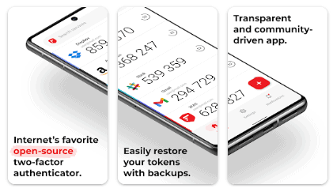

Jeder SeaTable Nutzer kann die **2-Faktor-Authentifizierung (2FA)** für das eigene Benutzerkonto aktivieren. Wie das geht, erfahren Sie in diesem Artikel.



Team-Administratoren können die 2-Faktor-Authentifizierung für Ihr gesamtes Team oder für ein einzelnes Teammitglied verpflichtend machen. Wie das geht, lernen Sie in diesen Artikeln: [2FA für ein Teammitglied aktivieren]() und [2FA für das gesamte Team erzwingen]().



## Was ist die 2-Faktor-Authentifizierung?

Eine 2-Faktor-Authentifizierung ist eine zusätzliche Sicherheitsmaßnahme zum Schutz Ihres Benutzerkontos gegen Hacking-Versuche, Phishing oder Brute-Force-Angriffe: Selbst wenn Ihre Passwörter in die falschen Hände gelangen, haben Unbefugte auf diese Weise keinen Zugriff auf Ihren Account.

Denn mit aktivierter Zwei-Faktor-Authentifizierung wird bei jedem Login zusätzlich zu Benutzername und Passwort noch ein zweiter Faktor eingefordert. Der zweite Faktor ist ein **sechsstelliger Zahlencode, der sich alle 30 Sekunden ändert**.

Dieser Code (ein sogenannter Token) wird typischerweise mithilfe einer **2FA-App** auf dem Smartphone oder Tablet des Nutzers erzeugt. Der zweite Faktor macht den Login zwar etwas aufwändiger, erhöht jedoch die Sicherheit enorm, da die Authentifizierung über ein zweites Gerät erforderlich ist, auf das nur der Nutzer Zugriff hat.

## Wie Sie die 2-Faktor-Authentifizierung einrichten

1. Klicken Sie auf der **Startseite** von SeaTable rechts oben auf Ihr Avatar-Bild.
2. Gehen Sie auf **Persönliche Einstellungen**.
3. Klicken Sie auf **2-Faktor Authentifizierung aktivieren**.
4. Scannen Sie den **QR-Code** mit Ihrer 2FA-App und geben Sie den **sechsstelligen Code** ein.
5. Speichern Sie die **Ersatz-Token** auf Ihrem PC.

Bei allen künftigen Logins müssen Sie den aktuellen sechsstelligen Code aus der 2FA-App eingeben, um Zugriff auf Ihr SeaTable Konto zu erhalten.

## Welche 2FA-App empfehlen wir?

Grundsätzlich können Sie jede beliebige 2FA-App verwenden, wobei wir gerne die App **2FA Authenticator (2FAS)** empfehlen. Diese ist zweckdienlich, schlank und erkennt SeaTable.

Sie finden die App in den bekannten App-Stores:

- [2FAS für iOS](https://apps.apple.com/de/app/2fa-authenticator-2fas/id1217793794)
- [2FAS für Android](https://play.google.com/store/apps/details?id=com.twofasapp&hl=en_IN)
