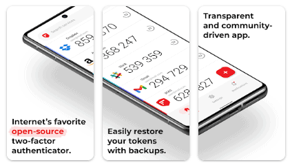

Каждый пользователь SeaTable может активировать **двухфакторную аутентификацию (2FA)** для своей учетной записи. Как это сделать, вы можете узнать в этой статье.

{{< warning  headline="Администраторы групп и двухфакторная аутентификация"  text="Администраторы команд могут сделать двухфакторную аутентификацию обязательной для всей команды или для одного члена команды. Узнайте, как это сделать в этих статьях: [Включить 2FA для одного члена команды](https://seatable.io/ru/docs/teamverwaltung/zwei-faktor-authentifizierung-fuer-ein-teammitglied-aktivieren/) и [Принудительная 2FA для всей команды](https://seatable.io/ru/docs/teamverwaltung/zwei-faktor-authentifizierung-fuer-das-gesamte-team-erzwingen/)." />}}

## Что такое двухфакторная аутентификация?

Двухфакторная аутентификация - это дополнительная мера безопасности для защиты вашей учетной записи от попыток взлома, фишинга или атак грубой силы: даже если ваши пароли попадут в чужие руки, посторонние лица не смогут получить доступ к вашей учетной записи таким образом.

При активированной двухфакторной аутентификации при каждом входе в систему запрашивается второй фактор в дополнение к имени пользователя и паролю. Второй фактор - это **шестизначный цифровой код, который меняется каждые 30 секунд**.

Этот код (так называемый токен) обычно генерируется с помощью **приложения 2FA** на смартфоне или планшете пользователя. Второй фактор немного усложняет вход в систему, но значительно повышает безопасность, поскольку аутентификация требуется через второе устройство, доступ к которому имеет только пользователь.

## Как настроить двухфакторную аутентификацию

1. Нажмите на изображение своего аватара в правом верхнем углу домашней **страницы** SeaTable.
2. Перейдите в раздел **Личные настройки**.
3. Нажмите **Включить двухфакторную аутентификацию**.
4. Отсканируйте **QR-код** с помощью приложения 2FA и введите **шестизначный код**.
5. Сохраните **сменные жетоны** на своем компьютере.

Для всех последующих входов в систему вам нужно будет вводить текущий шестизначный код из приложения 2FA, чтобы получить доступ к вашему счету SeaTable.

## Какое приложение 2FA мы рекомендуем?

В принципе, вы можете использовать любое приложение 2FA, хотя мы хотели бы порекомендовать приложение **2FA Authenticator (2FAS)**. Оно полезное, тонкое и распознает SeaTable.

Приложение можно найти в известных магазинах приложений:

- [2FAS для iOS](https://apps.apple.com/de/app/2fa-authenticator-2fas/id1217793794)
- [2FAS для Android](https://play.google.com/store/apps/details?id=com.twofasapp&hl=en_IN)
