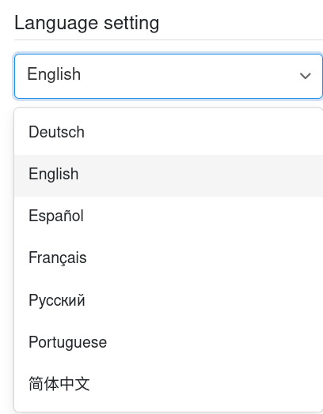

¿Quiere cambiar el **idioma** en SeaTable? No se preocupe. Puede cambiar el idioma de la interfaz en cualquier momento en unos pocos pasos a través de la **configuración personal** de su cuenta.

El **idioma de la interfaz** es el idioma en el que SeaTable se comunica con usted y en el que usted interactúa con SeaTable en la interfaz de usuario. Esto incluye todas las etiquetas preestablecidas, sugerencias y opciones de menú.



## Personalizar el idioma de la interfaz

1. Cambie a la **página de inicio** de SeaTable.
2. Haga clic en la **imagen de su avatar** en la esquina superior derecha para abrir el menú desplegable.

3. Haga clic en **Configuración personal**.
4. En la sección "Idioma", seleccione cualquier **idioma** del menú desplegable.

5. El idioma seleccionado se adopta automáticamente como nuevo **idioma de interfaz**.

## Idiomas disponibles

Actualmente están disponibles los siguientes idiomas de interfaz:

- Alemán
- Inglés
- Español
- Francés
- Ruso
- Portugués
- Chino
