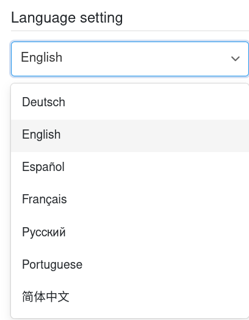

Vous souhaitez changer la **langue** de SeaTable ? Pas de problème ! Vous pouvez à tout moment modifier la langue de l'interface en quelques étapes seulement via les **paramètres personnels** de votre compte.

La **langue d'interface** est la langue dans laquelle SeaTable communique avec vous et dans laquelle vous interagissez avec SeaTable dans l'interface utilisateur. Cela inclut tous les libellés prédéfinis, les indications et les options de menu.



## Personnaliser le langage de l'interface

1. Passez à la **page d'accueil** de SeaTable.
2. Cliquez sur l'**image de votre avatar** dans le coin supérieur droit pour ouvrir le menu déroulant.

3. Cliquez sur **Paramètres personnels**.
4. Dans la section "Langue", choisissez n'importe quelle **langue** dans le menu déroulant.

5. La langue sélectionnée est automatiquement adoptée comme nouvelle **langue d'interface**.

## Langues disponibles

Actuellement, les langues d'interface suivantes sont disponibles :

- Allemand
- Anglais
- Espagnol
- Français
- Russe
- Portugais
- Chinois
