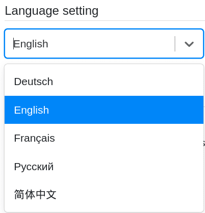

Вы хотите изменить **язык** в SeaTable? Нет проблем! Вы можете в любое время изменить язык интерфейса всего за несколько шагов через **личные настройки** вашей учетной записи.

**Язык интерфейса** - это язык, на котором SeaTable общается с вами и на котором вы взаимодействуете с SeaTable на пользовательском интерфейсе. Сюда входят все предустановленные ярлыки, подсказки и пункты меню.



## Настройка языка интерфейса

1. Переключитесь на **начальную** страницу SeaTable.
2. Нажмите на **изображение** вашего **аватара** в правом верхнем углу, чтобы открыть выпадающее меню.

4. Нажмите на **Личные настройки**.
5. В разделе "Язык" выберите любой **язык** из выпадающего меню.

7. Выбранный язык автоматически принимается в качестве нового **языка интерфейса**.

## Доступные языки

В настоящее время доступны следующие языки интерфейса:

- Немецкий
- Английский язык
- Французский
- Русский
- Китайский
