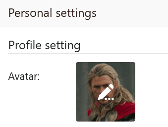

Ihr eigenes **Avatarbild** können Sie in nur wenigen Schritten in den **persönlichen Einstellungen** Ihres Kontos anpassen.

Ein Avatarbild ist hilfreich, damit andere Teammitglieder Sie schnell in SeaTable identifizieren können, denn das Bild wird beispielsweise auch als Miniatur in [Mitarbeiter-](), [Ersteller-](https://seatable.io/docs/datum-dauer-und-personen/die-spalten-ersteller-und-erstellt/) und [Letzter-Bearbeiter](https://seatable.io/docs/datum-dauer-und-personen/die-spalten-letzter-bearbeiter-und-zuletzt-bearbeitet/)\-Spalten sowie bei Freigaben vor Ihrem Namen angezeigt.

## So passen Sie Ihr Avatarbild an

1. Wechseln Sie zur **Startseite** von SeaTable.
2. Klicken Sie auf das **Avatarbild** in der oberen rechten Ecke, um das Drop-down-Menü zu öffnen.
   4. Klicken Sie auf **Persönliche Einstellungen**.
3. Fahren Sie mit der Maus über das **Quadrat**, in dem Ihr **aktuelles Avatarbild** zu sehen ist, und klicken Sie auf das erscheinende **Stift-Symbol** .
   7. Wählen Sie in dem sich öffnenden Fenster "Datei hochladen" ein **neues Bild** als Avatarbild aus.


