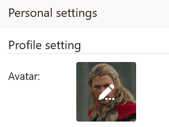

Вы можете настроить **изображение** своего **аватара** всего за несколько шагов в **личных настройках** своей учетной записи.

Изображение аватара полезно для того, чтобы другие члены команды могли быстро идентифицировать вас в SeaTable, поскольку изображение также отображается в виде эскиза, например, в [колонках]()", " [Создатель"](), а также перед вашим именем в акциях.

## Чтобы настроить изображение своего аватара

1. Переключитесь на **начальную** страницу SeaTable.
2. Нажмите на **изображение аватара** в правом верхнем углу, чтобы открыть выпадающее меню.

4. Нажмите на **Личные настройки**.
5. Наведите курсор мыши на **квадрат**, содержащий **изображение** вашего **текущего аватара**, и нажмите на появившийся **значок карандаша** .

7. В открывшемся окне "Загрузка файла" выберите **новую картинку** в качестве изображения аватара.


