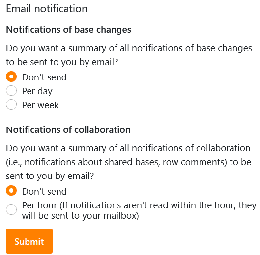
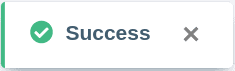

Vous ne souhaitez **plus** recevoir de **notifications par e-mail** sur les modifications apportées aux bases et/ou sur la collaboration (par ex. bases partagées, commentaires) ? Pas de problème ! Dans les **paramètres personnels** de votre compte, vous pouvez à tout moment vous désabonner en quelques étapes seulement.

1. Passez à la **page d'accueil** de SeaTable.
2. Cliquez sur l'**image de** votre **avatar** dans le coin supérieur droit pour ouvrir le menu déroulant.

4. Cliquez sur **Paramètres personnels**.
5. Dans la section "Notification par e-mail", sélectionnez **Ne pas envoyer** pour les notifications non sollicitées.

7. Confirmez en cliquant sur **Envoyer**.

Un **message de succès** s'affiche ensuite, vous informant que vos modifications ont été enregistrées.


