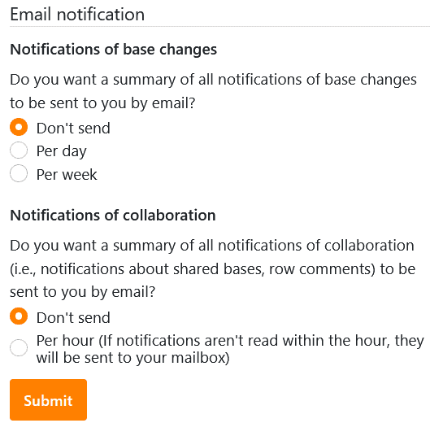

Já **não** quer receber **notificações por e-mail** sobre alterações de bases e/ou sobre colaboração (por exemplo, bases partilhadas, comentários)? Não há problema! Nas **configurações pessoais da** sua conta, pode cancelar a subscrição a qualquer momento em apenas alguns passos.

1. Mudar para a página **inicial** da SeaTable.
2. Clique na **imagem do** seu **avatar** no canto superior direito para abrir o menu drop-down.

4. Clique em **Personal Settings (Definições pessoais**).
5. Na secção Notificação por e-mail, seleccione **Não enviar** para as notificações indesejadas.

7. Confirmar com **Submeter**.

Aparecerá então uma **mensagem de sucesso** informando-o de que as suas alterações foram guardadas.


