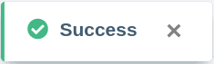

Вы больше **не** хотите получать **уведомления по электронной почте** об изменениях в базах и/или о совместной работе (например, общие базы, комментарии)? Нет проблем! В **личных настройках** вашей учетной записи вы можете в любой момент отказаться от рассылки всего за несколько шагов.

1. Переключитесь на **начальную** страницу SeaTable.
2. Нажмите на **изображение** вашего **аватара** в правом верхнем углу, чтобы открыть выпадающее меню.

4. Нажмите на **Личные настройки**.
5. В разделе Уведомления по электронной почте выберите опцию **Не отправлять** для нежелательных уведомлений.

7. Подтвердите нажатием кнопки **Отправить**.

Затем появится **сообщение об успехе**, информирующее о том, что изменения были сохранены.


