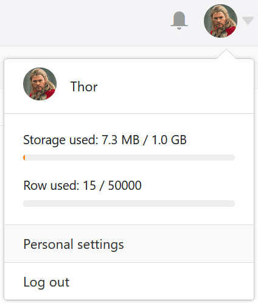
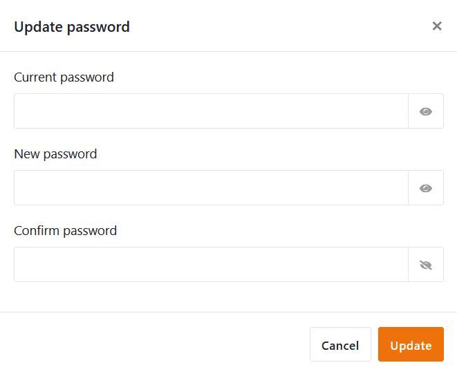
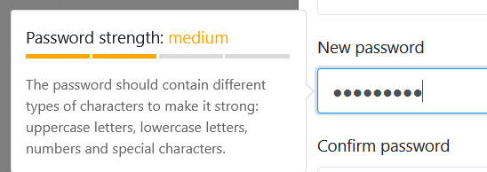

Vous souhaitez modifier votre propre **mot de passe**? Pas de problème ! Vous pouvez le faire en quelques étapes dans les **paramètres personnels** de votre compte.

## Pour modifier votre mot de passe

1. Passez à la **page d'accueil** de SeaTable.
2. Cliquez sur l'**image de** votre **avatar** dans le coin supérieur droit pour ouvrir le menu déroulant.

4. Cliquez sur **Paramètres personnels**.
5. Dans la section "Mot de passe", cliquez sur **Mettre à jour**.
6. Remplissez les champs affichés :
    - **Mot de passe actuel**
    - **Nouveau mot de passe**
    - **Confirmer le mot de passe**

Pour afficher un mot de passe **en clair**, cliquez sur l'**icône** en **forme d'œil** à droite. De plus, la **force de** votre nouveau mot de passe s'affiche automatiquement.

10. Confirmez la modification de votre mot de passe en cliquant sur **Actualiser**.
