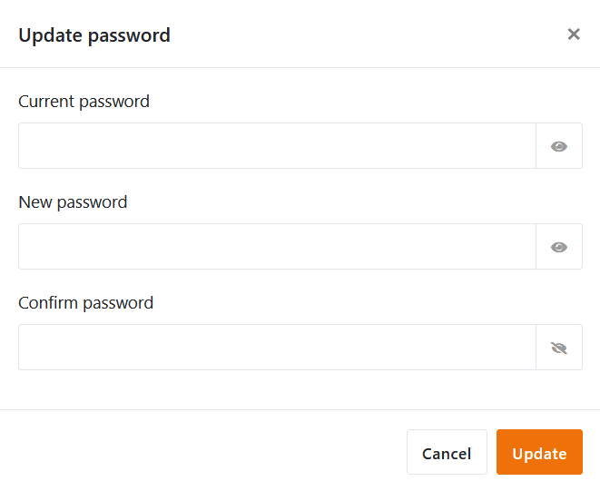
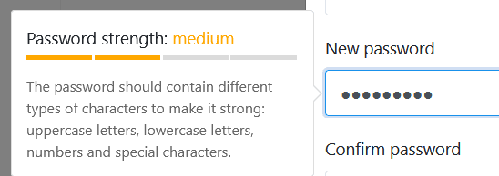

Хотите изменить собственный **пароль**? Нет проблем! Вы можете сделать это всего за несколько шагов в **личных настройках** вашей учетной записи.

## Чтобы изменить пароль

1. Переключитесь на **начальную** страницу SeaTable.
2. Нажмите на **изображение** вашего **аватара** в правом верхнем углу, чтобы открыть выпадающее меню.

4. Нажмите на **Личные настройки**.
5. Нажмите кнопку **Обновить** в разделе Пароль.
6. Заполните отображаемые поля:
    - **Текущий пароль**
    - **Новый пароль**
    - **Подтверждение пароля**

Чтобы отобразить пароль в виде **обычного текста**, нажмите на **символ глаза** справа от него. Вы также автоматически увидите **силу** вашего нового пароля.

10. Подтвердите изменение пароля командой **Update**.
