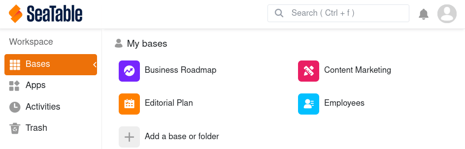

With a large number of bases and apps, it can become quite confusing on your homepage. Therefore, use SeaTable's practical search function to find bases and apps quickly.

- Open the **Homepage** of SeaTable.
- Use the **key combination**  +  or click in the **search field** in the top right corner.
- Select whether you want to search your **bases** or your **apps**.
- Now enter a **part of the name** of the base or app you are looking for in the search field – and SeaTable will provide you with all matching **search results**.
- Click on the **name** in the hit list to open the desired base or app.



You will also see your last search results in a **search history** and can access these bases and apps directly.

