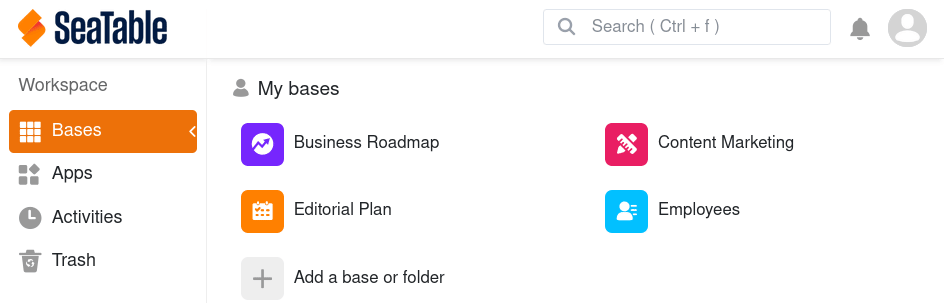
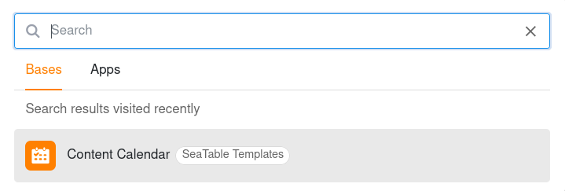

Con un gran número de bases y aplicaciones, la página de inicio puede resultar bastante confusa. Utilice la práctica función de búsqueda de SeaTable para encontrar bases y aplicaciones rápidamente.

- Abra la **página de inicio** de SeaTable.
- Utilice la **combinación de teclas**  +  o haga clic en el **campo de búsqueda** de la esquina superior derecha.
- Seleccione si desea buscar en sus **Bases** o en sus **Aplicaciones**.
- Introduzca una **parte del nombre** de la base o aplicación que busca en el campo de búsqueda – y SeaTable le proporcionará todos los **resultados de búsqueda** que coincidan.
- Haga clic en el **nombre** de la lista de resultados para abrir la base o app deseada.



También verá los resultados de su última búsqueda en un **historial de búsqueda** y podrá acceder directamente a estas bases y aplicaciones.

