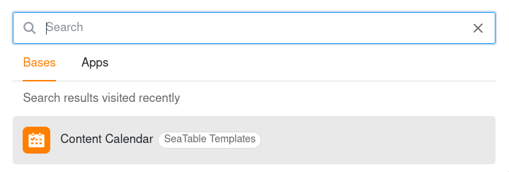

Si vous avez un grand nombre de bases et d'applications, votre page d'accueil risque d'être encombrée. Utilisez donc la fonction de recherche pratique de SeaTable pour trouver rapidement des bases et des applications.

- Ouvrez la **page d'accueil** de SeaTable.
- Utilisez la **combinaison de touches**  +  ou cliquez dans le **champ de recherche** dans le coin supérieur droit.
- Choisissez si vous voulez rechercher dans vos **bases** ou dans vos **applications**.
- Saisissez ensuite une **partie du nom** de la base ou de l'app que vous recherchez dans le champ de recherche – et SeaTable vous fournira tous les **résultats de recherche** correspondants.
- Dans la liste des résultats, cliquez sur le **nom** pour ouvrir la base ou l'application souhaitée.



Vous pouvez également voir vos derniers résultats de recherche dans un **historique de recherche** et accéder directement à ces bases et apps.

