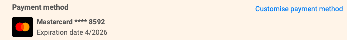
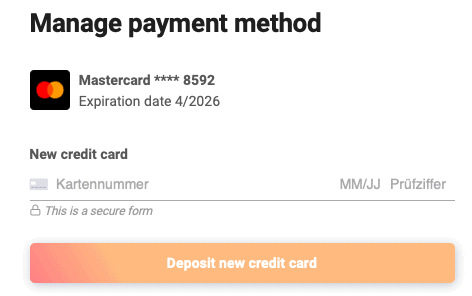



You want to change the credit card you used to pay your SeaTable subscription? No problem, via the team management this is done with just a few steps.

## Change credit card

1. Open the **team management**.
2. Click on **Subscription**.
3. Click on **"Customize payment method**".
4. Deposit a **new** credit card.
5. Confirm with **"Deposit new credit card"**.
6. The newly deposited credit card is valid **immediately** and replaces the old card.

## Frequently asked questions about payment by credit card

Currently Visa, Mastercard, American Express, China UnionPay and Cartes Bancaires are accepted.

Currently, a credit card cannot be deleted. However, it will only be charged as long as you have a paid subscription.

Your credit card information is only stored by our payment service provider Stripe. SeaTable does not store your payment information.


