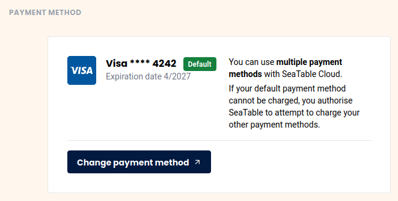



You want to change the credit card you used to pay your SeaTable subscription? No problem, via the team administration this is done with just a few steps.

## Change credit card

1. Open the **Team administration**.
2. Click on **Subscription**.
3. Click on **"Edit Payment Method"**.
    

4. You will be redirected to the Stripe online portal where you can store a **new or additional** credit card.
5. You can freely choose which credit card should be used for future payments.

## Frequently asked questions about payment by credit card

Currently Visa, Mastercard, American Express, China UnionPay and Cartes Bancaires are accepted.


You can delete a credit card as long as it is not being used as the default payment method for your current subscription.


Your credit card information is only stored by our payment service provider Stripe. SeaTable does not store your payment information.

