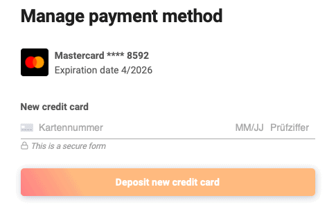



Вы хотите изменить кредитную карту, которую вы использовали для оплаты подписки на SeaTable? Нет проблем, это можно сделать всего за несколько шагов через администрацию команды.

## Изменить кредитную карту

1. Откройте **администрацию команды**.
2. Нажмите на **Подписку**.
3. Нажмите на кнопку **"Настроить способ оплаты**".
4. **Пополните счет новой** кредитной карты.
5. Подтвердите команду **"Пополнить счет новой кредитной карты"**.
6. Вновь внесенная кредитная карта действует **немедленно** и заменяет старую карту.

## Часто задаваемые вопросы об оплате кредитной картой

В настоящее время к оплате принимаются Visa, Mastercard, American Express, China UnionPay и Cartes Bancaires.

В настоящее время кредитная карта не может быть отменена. Однако средства с нее будут списываться только до тех пор, пока у вас есть оплаченная подписка.

Данные вашей кредитной карты хранятся только у нашего поставщика платежных услуг Stripe. SeaTable не хранит вашу платежную информацию.


