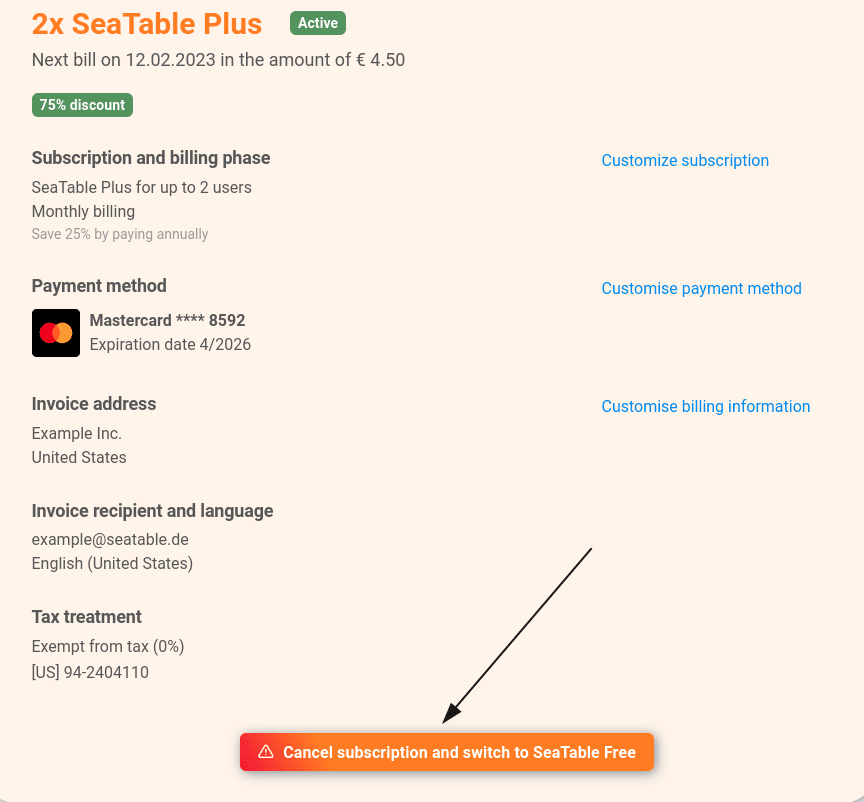

In team administration, as a **team administrator**, you can make changes to the subscription at any time. Learn how to make changes, when they take effect, and what effects they have on the term in this article.

## Effectiveness of changes

Basically, **upgrades** take effect immediately, whereas **downgrades** are always made at the end of the current term. The following table shows this in overview. You can view the respective **remaining term of** your SeaTable subscription in the **team administration** at any time.

| Action                   | Effectiveness          |
| ------------------------ | ---------------------- |
| Free → Plus              | Immediately            |
| Free → Enterprise        | Immediately            |
| Plus → Free              | At the end of the term |
| Enterprise → Free        | At the end of the term |
| More team members        | Immediately            |
| Fewer team members       | At the end of the term |
| Monthly → annual billing | Immediately            |
| Annual → monthly billing | At the end of the term |

## Term and the pro rata payment of changes

Changes to your subscription usually do not affect the term. The only exception is a change from monthly to annual payment. In this case, the new term starts with the change.

| Change                                | Effect on the runtime |
| ------------------------------------- | --------------------- |
| Number of team members                | none                  |
| Subscription upgrade                  | none                  |
| Change from monthly to annual payment | new term              |

Of course, you also only pay the respective **pro-rata amount** for each change. For example, if you add an additional team member, you only pay the prorated price based on the remaining term. If you upgrade your subscription, the remaining value of your current subscription will be deducted from the new price.

## Customize current subscription



1. Open the **Team administration**.
2. Switch to the **Subscription** section.
3. Click **Customize Subscription**.
4. Make the desired changes to the **subscription**, **number of users**, and **billing period**.
5. Confirm the change of your subscription with **Adjust subscription with costs**.

## Cancellation of your paid subscription

You can return to the free subscription at the end of the already paid term. For this, you need to cancel your paid subscription.



Canceling your paid subscription will not delete your team or data. Your team will only be downgraded to the free SeaTable Free at the end of the term. To learn how to delete your team completely, [click here]().



1. Open the **Team administration**.
2. Click on **Subscription**.
3. Click **Cancel Subscription and switch to SeaTable Free**.

5. Carefully read the **instructions on** how to switch to SeaTable Free.
6. Activate the **slider** and confirm the change of your subscription with **Cancel subscription and switch to SeaTable Free**.

