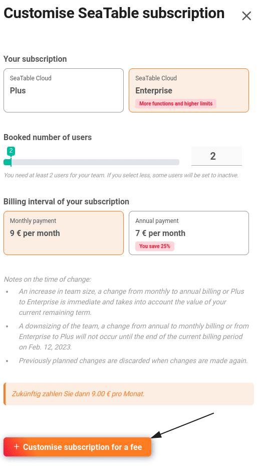

En la administración del equipo, usted, como **administrador del equipo**, puede realizar cambios en la suscripción en cualquier momento. En este artículo se explica cómo realizar cambios, cuándo surten efecto y qué efectos tienen sobre la duración.

## Eficacia de los cambios

Básicamente, **las actualizaciones** tienen efecto inmediato, mientras que **las reducciones** se realizan siempre al final del periodo actual. En la siguiente tabla se muestra una visión general, en la que puede ver el **plazo restante** de su suscripción a SeaTable en cualquier momento en la **administración del equipo**.

| Acción                      | Eficacia           |
| --------------------------- | ------------------ |
| Gratis → Plus               | Inmediatamente     |
| Gratuito → Empresa          | Inmediatamente     |
| Plus → Gratis               | Al final del plazo |
| Empresa → Gratis            | Al final del plazo |
| Más miembros del equipo     | Inmediatamente     |
| Menos miembros del equipo   | Al final del plazo |
| Facturación mensual → anual | Inmediatamente     |
| Facturación anual → mensual | Al final del plazo |

## Plazo y pago prorrateado de los cambios

Los cambios de abono no suelen afectar a la duración del mismo. La única excepción es el cambio de pago mensual a pago anual. En este caso, el nuevo plazo comienza con el cambio.

| Cambia                              | Efecto sobre el tiempo de funcionamiento |
| ----------------------------------- | ---------------------------------------- |
| Número de miembros del equipo       | ninguno                                  |
| Actualización de la suscripción     | ninguno                                  |
| Cambio de pago mensual a pago anual | nueva legislatura                        |

Por supuesto, sólo pagará el **importe pr**orrateado correspondiente a cada cambio. Por ejemplo, si añade un miembro más al equipo, sólo pagará el precio prorrateado en función del plazo restante. Si actualiza su suscripción, el valor restante de su suscripción actual se deducirá del nuevo precio.

## Personalizar la suscripción actual



1. Abre la **administración del equipo**.
2. Pase a la sección **Suscripción**.
3. Haga clic en **Personalizar suscripción**.
4. Realice los cambios deseados en la **suscripción**, el **número de usuarios** y el **periodo de facturación**.
5. Confirme el cambio de su abono con **Ajustar abono de pago**.

## Cancelación de la suscripción de pago

Puede volver a la suscripción gratuita al final del periodo que ya ha pagado. Para ello, debe cancelar su suscripción de pago.



1. Abre la **administración del equipo**.
2. Haga clic en **Suscripción**.
3. Haga clic en **Cancelar suscripción y cambie a SeaTable Free**.

5. Lea atentamente las **instrucciones para** cambiar a SeaTable Free.
6. Active el **control deslizante** y confirme el cambio de su suscripción con **Cancelar suscripción y cambiar a SeaTable Free**.

