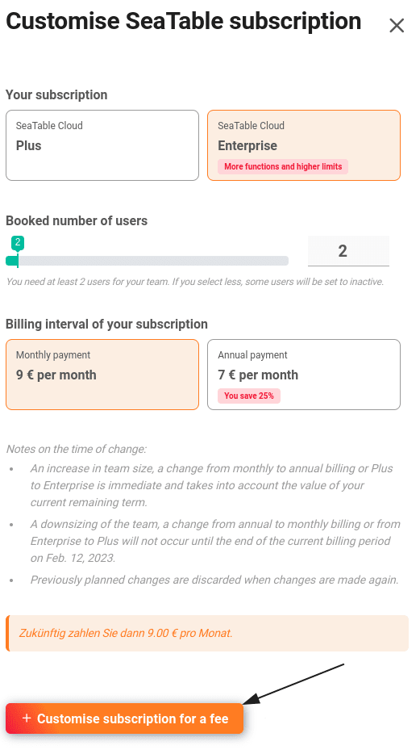
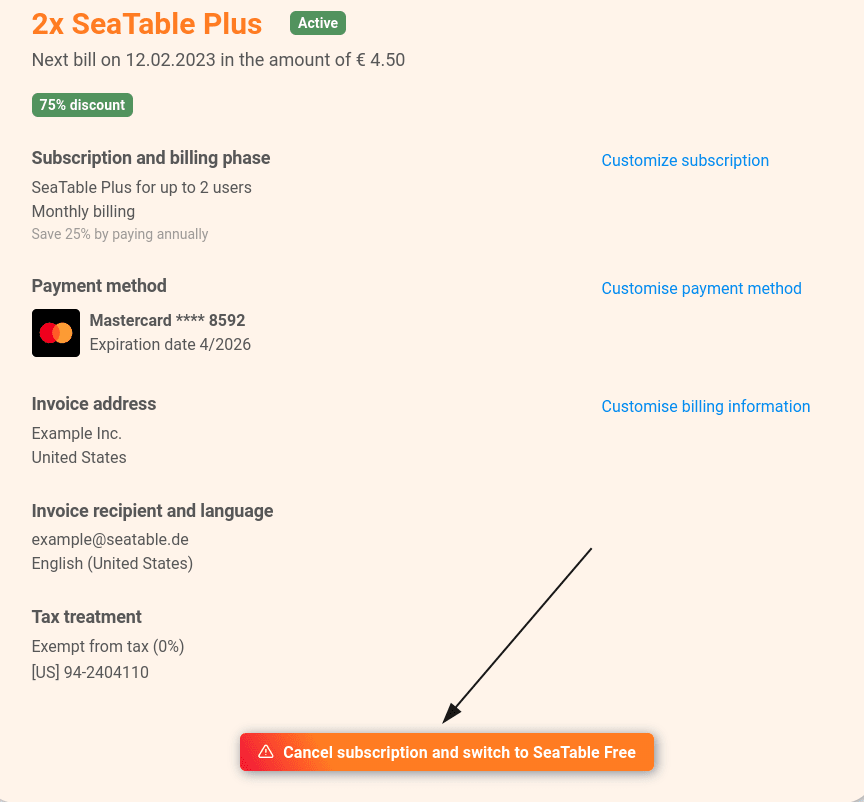
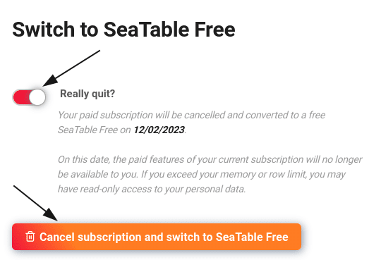

Dans la gestion d'équipe, vous pouvez, en tant qu'**administrateur d'équipe**, apporter à tout moment des modifications à l'abonnement. Vous apprendrez dans cet article comment effectuer des modifications, quand elles prennent effet et quelles en sont les conséquences sur la durée de l'abonnement.

## Efficacité des modifications

En principe, **les mises à niveau** prennent effet immédiatement, tandis que **les rétrogradations** sont toujours effectuées à la fin de la période actuelle. Le tableau suivant en donne un aperçu, sachant que vous pouvez consulter à tout moment la **durée restante** de votre abonnement SeaTable dans la **gestion d'équipe**.

| Action                           | Efficacité             |
| -------------------------------- | ---------------------- |
| Free → Plus                      | Immédiatement          |
| Gratuit → Entreprise             | Immédiatement          |
| Plus → Gratuit                   | À la fin de la période |
| Entreprise → Gratuit             | À la fin de la période |
| Plus de membres de l'équipe      | Immédiatement          |
| Moins de membres de l'équipe     | À la fin de la période |
| Facturation mensuelle → annuelle | Immédiatement          |
| Facturation annuelle → mensuelle | À la fin de la période |

## durée et le paiement au prorata des modifications

Les modifications apportées à votre abonnement n'ont généralement pas d'incidence sur la durée de celui-ci. La seule exception est le passage d'un mode de paiement mensuel à un mode de paiement annuel. Dans ce cas, la nouvelle durée commence avec le changement.

| Variation                                      | Effet sur la durée |
| ---------------------------------------------- | ------------------ |
| Nombre de membres de l'équipe                  | pas de             |
| Mise à niveau de l'abonnement                  | pas de             |
| Passage du paiement mensuel au paiement annuel | nouvelle durée     |

Bien entendu, vous ne payez que le **montant proportionnel** à chaque modification. Par exemple, si vous ajoutez un membre supplémentaire à votre équipe, vous ne payez que le prix proportionnel à la durée restante. Si vous mettez votre abonnement à niveau, la valeur restante de votre abonnement actuel sera déduite du nouveau prix.

## Adapter l'abonnement actuel



1. Ouvrez la **gestion d'équipe**.
2. Passez à la section **Abonnement**.
3. Cliquez sur **Personnaliser l'abonnement**.
4. Apportez les modifications souhaitées à l'**abonnement**, au **nombre d'utilisateurs** et à la **période de facturation**.
5. Confirmez la modification de votre abonnement en cliquant sur **Modifier l'abonnement payant**.

## Résiliation de votre abonnement payant

Vous pouvez revenir à l'abonnement gratuit à la fin de la période déjà payée. Pour cela, vous devez résilier votre abonnement payant.



1. Ouvrez la **gestion d'équipe**.
2. Cliquez sur **Abonnement**.
3. Cliquez sur **Annuler l'abonnement et passer à SeaTable Free**.

5. Lisez attentivement les **instructions** pour passer à SeaTable Free.
6. Activez le **curseur** et confirmez la modification de votre abonnement en cliquant sur **Annuler l'abonnement et passer à SeaTable Free**.

