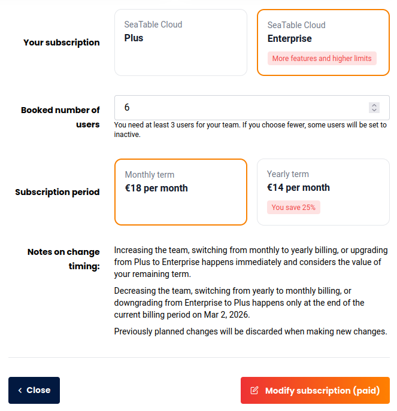
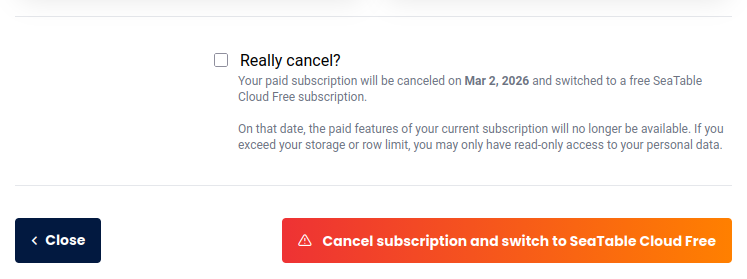

Na administração da equipa, enquanto **administrador da equipa**, pode fazer alterações à subscrição em qualquer altura. Este artigo explica como efetuar alterações, quando estas entram em vigor e quais os efeitos que têm na duração.

## Eficácia das mudanças

Basicamente, **os upgrades** têm efeito imediato, enquanto **os downgrades** são sempre efectuados no final do período atual. A tabela seguinte mostra esta situação de forma geral, sendo que pode visualizar o **período restante da** sua subscrição SeaTable em qualquer altura na **administração da equipa**.

| Acção                    | Eficácia          |
| ------------------------ | ----------------- |
| Gratuito → Mais          | Imediatamente     |
| Gratuito → Empresa       | Imediatamente     |
| Mais → Grátis            | No final do termo |
| Empresa → Gratuito       | No final do termo |
| Mais membros da equipa   | Imediatamente     |
| Menos membros da equipa  | No final do termo |
| Faturação mensal → anual | Imediatamente     |
| Faturação anual → mensal | No final do termo |

## Prazo e pagamento pro rata das alterações

As alterações à sua subscrição não têm normalmente qualquer efeito sobre o prazo. A única exceção é uma mudança de pagamento mensal para anual. Neste caso, o novo prazo começa com a alteração.

| Alterar                                          | Efeito sobre o tempo de funcionamento |
| ------------------------------------------------ | ------------------------------------- |
| Número de membros da equipa                      | nenhuma                               |
| Actualização da subscrição                       | nenhuma                               |
| Mudança de pagamento mensal para pagamento anual | novo termo                            |

Naturalmente, só paga o respetivo **montante proporcional** por cada alteração. Por exemplo, se adicionar mais um membro da equipa, pagará apenas o preço pro-rata com base no prazo restante. Se atualizar a sua subscrição, o valor restante da sua subscrição atual será deduzido do novo preço.

## Personalizar a subscrição actual



1. Abra a **Gestão de Equipa**.
2. Mude para a secção **Subscrição**.
3. Clique em **Editar Subscrição**.
    

4. Efectue as alterações desejadas na **subscrição**, no **número de utilizadores** e no **período de faturação**.
5. Confirme a alteração da sua subscrição com **Modificar Subscrição Paga**.

## Cancelamento da sua subscrição paga

Pode voltar à subscrição gratuita Free no final do período já pago. Para tal, deve cancelar a sua subscrição paga.



O cancelamento da sua subscrição paga não leva à eliminação da sua equipa ou dos seus dados. A sua equipa será simplesmente rebaixada para SeaTable Free gratuito no final do período. Saiba como eliminar completamente a sua equipa [aqui]().



1. Abra a **Gestão de Equipa**.
2. Clique em **Subscrição**.
3. Clique em **Cancelar Subscrição**.
4. Leia atentamente as **notas** sobre a mudança para SeaTable Free.
    
5. Confirme a alteração da sua subscrição com **Cancelar Subscrição e Mudar para SeaTable Free**.
