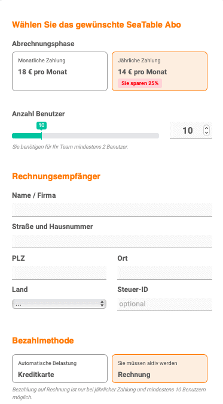

SeaTable bietet für die Buchung eines Plus- oder Enterprise Abonnements aktuell zwei Zahlungsmethoden an. Die **Kreditkarte** ist dabei die Bezahlmethode, die in den allermeisten Fällen zum Einsatz kommt. Dank unseres Zahlungsdienstleisters Stripe akzeptieren wir Zahlungen per Visa, Mastercard, American Express, China UnionPay und Cartes Bancaires.

Eine Bezahlung auf **Rechnung** ist hingegen nur unter bestimmten Voraussetzungen möglich. Welche dies sind, erfahren Sie in diesem Artikel.

## Voraussetzungen für die Bezahlung per Rechnung

- Sie schließen für Ihr Team ein **Enterprise-Abo** ab.
- Ihr Team hat eine Mindestgröße von **10 Teammitgliedern**.
- Als Laufzeit wird Jahres-Abonnement gewählt, sodass die Kosten für **ein Jahr im Voraus** bezahlt werden.

Wenn diese Voraussetzungen gegeben sind, können Sie jederzeit in der Teamverwaltung die Bezahlung per Rechnung aktivieren. Dies geht sowohl bei der initialen Buchung eines neuen kostenpflichtigen Abos und wenn Sie schon bereits über ein kostenpflichtiges Abo verfügen.

Anschließend erhalten Sie von uns eine Rechnung mit der Aufforderung den Rechnungsbetrag auf unser deutsches Bankkonto zu überweisen.

